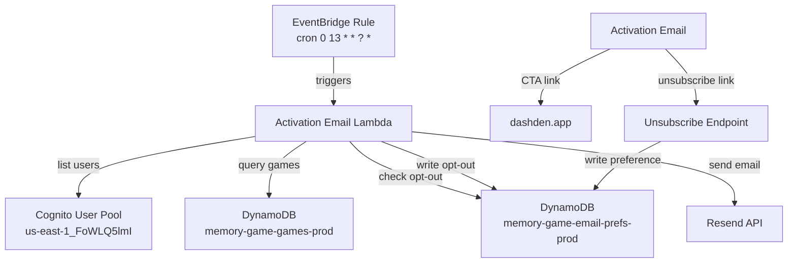

# Design Document: Inactive User Activation Email

## Overview

This feature adds a daily activation email system that targets inactive users — those who signed up for DashDen but have never played a game. The system identifies eligible users by cross-referencing Cognito user accounts with game records in DynamoDB, filters out opted-out users, and sends a personalized HTML email via the Resend API encouraging them to play their first game.

The activation email handler will be implemented as a new Lambda handler (`activation-email.ts`) in the existing game service, following the same patterns established by `daily-email.ts`. It will be triggered by an EventBridge cron rule at 8am EST daily.

### Design Decisions

1. **Separate handler file** rather than adding to `daily-email.ts` — keeps concerns separated (digest for active users vs. activation for inactive users) and allows independent scheduling/monitoring.
2. **Reuse existing infrastructure** — same Resend API integration, same email-prefs table, same Cognito query patterns from `admin.service.ts`.
3. **Add `activationEmails` opt-out field** to the email-prefs table — allows independent opt-out from activation emails vs. daily digest.
4. **Simple unsubscribe via existing profile page** — the unsubscribe link directs to a dedicated unsubscribe endpoint that writes the opt-out preference without requiring login.

## Architecture



### Flow

1. EventBridge triggers the Lambda at 8am EST daily (UTC `cron(0 13 * * ? *)` during EDT, `cron(0 13 * * ? *)` during EST — note: 13:00 UTC = 8am EST and 9am EDT, so for exact 8am ET year-round, the cron should be `cron(0 13 * * ? *)` during EST and `cron(0 12 * * ? *)` during EDT. Since EventBridge doesn't support timezone-aware crons, we'll use `cron(0 13 * * ? *)` which is 8am EST / 9am EDT — acceptable tradeoff).
2. Lambda queries Cognito for all verified users.
3. For each user, Lambda queries the games table for any records.
4. Users with zero game records are classified as inactive.
5. Lambda checks the email-prefs table for opt-out flags.
6. For each eligible user (inactive + not opted out), Lambda renders and sends the activation email via Resend.
7. Lambda logs summary metrics and returns a response with counts.

## Components and Interfaces

### 1. Activation Email Handler (`services/game/src/activation-email.ts`)

The main Lambda entry point, exported as `handler`.

```typescript
interface ActivationEmailResult {
  statusCode: number;
  body: string;
  summary: {
    totalCognitoUsers: number;
    inactiveUsers: number;
    optedOutUsers: number;
    eligibleUsers: number;
    emailsSent: number;
    emailsFailed: number;
  };
}

export async function handler(): Promise<ActivationEmailResult>
```

**Responsibilities:**
- Query Cognito user pool for verified users (paginated via `ListUsersCommand`)
- For each user, query games table to determine if inactive (zero records)
- Check email-prefs table for `activationEmailOptOut` field
- Render personalized email HTML
- Send via Resend API
- Log metrics and return summary

### 2. User Eligibility Logic

```typescript
interface CognitoUser {
  userId: string;       // sub attribute
  email: string;        // email attribute
  username: string;     // preferred_username or name
  emailVerified: boolean;
}

function isUserInactive(gameCount: number): boolean
// Returns true when gameCount === 0

function isUserEligible(user: CognitoUser, gameCount: number, optedOut: boolean): boolean
// Returns true when: emailVerified && gameCount === 0 && !optedOut
```

### 3. Email Template Builder

```typescript
function buildActivationEmailHTML(username: string): string
// Renders the activation email HTML with personalized greeting

function getActivationEmailSubject(): string
// Returns subject line with DashDen name and game emoji
```

### 4. Unsubscribe Mechanism

A simple approach: the unsubscribe link in the email points to a URL like `https://dashden.app/unsubscribe?userId={userId}&type=activation`. The web app handles this by calling the game service API which writes the opt-out preference to the email-prefs table.

Alternatively, a standalone Lambda endpoint could handle unsubscribes without requiring login. Given simplicity, we'll use the existing game service API with a public unsubscribe mutation.

```typescript
// Added to email-prefs.service.ts
async setActivationEmailOptOut(userId: string, optOut: boolean): Promise<void>
```

## Data Models

### Email Preferences Table (Updated)

Table: `memory-game-email-prefs-prod`  
Partition key: `userId`

```typescript
interface EmailPrefs {
  userId: string;
  email: string;
  username: string;
  dailyDigest: boolean;            // existing field
  activationEmailOptOut: boolean;  // NEW field — true means opted out
  updatedAt: string;
}
```

### Games Table Query

Table: `memory-game-games-prod`  
Partition key: `userId`, Sort key: `gameId`

To check if a user has any games, we query with `Limit: 1`:
```typescript
const result = await ddb.send(new QueryCommand({
  TableName: GAMES_TABLE,
  KeyConditionExpression: 'userId = :uid',
  ExpressionAttributeValues: { ':uid': userId },
  Limit: 1,
  Select: 'COUNT',
}));
const hasGames = (result.Count || 0) > 0;
```

### Cognito User Pool Query

Pool: `us-east-1_FoWLQ5lmI`

Paginated query using `ListUsersCommand` with pagination token. Filter for `email_verified = true`.

## Correctness Properties

*A property is a characteristic or behavior that should hold true across all valid executions of a system — essentially, a formal statement about what the system should do. Properties serve as the bridge between human-readable specifications and machine-verifiable correctness guarantees.*

### Property 1: User classification is determined solely by game count

*For any* user with a game count, the system SHALL classify that user as inactive if and only if their game count equals zero. Users with one or more games SHALL always be classified as active.

**Validates: Requirements 1.2, 1.3, 4.1**

### Property 2: Opted-out users are always excluded

*For any* set of inactive users, if a user has `activationEmailOptOut = true` in the email preferences table, that user SHALL be excluded from the eligible recipient list regardless of their game count or other attributes.

**Validates: Requirements 1.4, 5.3**

### Property 3: Email personalization includes username

*For any* user with a username string, the rendered activation email HTML SHALL contain that username in the greeting section.

**Validates: Requirements 3.2**

### Property 4: Email mentions at least one game

*For any* rendering of the activation email, the HTML body SHALL contain at least one game name from the known DashDen game catalog.

**Validates: Requirements 3.5**

### Property 5: Subject line contains brand and emoji

*For any* activation email sent, the subject line SHALL contain the string "DashDen" and at least one emoji character from the game-related emoji set.

**Validates: Requirements 6.2**

### Property 6: Body content is concise

*For any* rendering of the activation email, the text content of the body (excluding footer) SHALL contain no more than 150 words.

**Validates: Requirements 6.3**

### Property 7: Error isolation — single failure does not halt processing

*For any* batch of N eligible users where sending to user K fails, all other N-1 users SHALL still be processed (attempted). The failure of one email send SHALL not prevent subsequent users from being processed.

**Validates: Requirements 7.2**

### Property 8: Summary response accuracy

*For any* execution with N eligible users where M sends fail, the returned summary SHALL report `emailsSent = N - M` and `emailsFailed = M` and `eligibleUsers = N`.

**Validates: Requirements 7.3**

## Error Handling

| Scenario | Handling |
|----------|----------|
| Cognito API failure | Log error, throw — entire run fails, CloudWatch alarm triggers |
| Games table query failure for one user | Log warning, skip user, continue processing others |
| Email-prefs table read failure | Log warning, assume user is eligible (fail open for sends) |
| Resend API failure for one email | Log error with userId, increment failed counter, continue |
| Resend API rate limit (429) | Log error, could retry with backoff for that user, else skip |
| All emails fail | Log critical error, return summary with all failed |
| Lambda timeout (approaching 15min) | Batch users and process in chunks; if near timeout, log partial progress |

### Error Logging Format

```typescript
console.error(`[ActivationEmail] Failed to send to userId=${userId}:`, {
  error: err.message,
  userId,
  email: maskedEmail, // mask for privacy in logs
});
```

### Summary Logging

```typescript
console.log(`[ActivationEmail] Run complete:`, {
  totalCognitoUsers,
  inactiveUsers,
  optedOutUsers,
  eligibleUsers,
  emailsSent,
  emailsFailed,
  durationMs,
});
```

## Testing Strategy

### Property-Based Tests (using fast-check)

Each correctness property will be implemented as a property-based test with minimum 100 iterations:

- **Property 1**: Generate random game counts (0, 1, 2, ..., 1000). Verify `isUserInactive(count)` returns `true` iff `count === 0`.
- **Property 2**: Generate random user sets with random opt-out flags. Verify opted-out users never appear in eligible list.
- **Property 3**: Generate random username strings. Verify `buildActivationEmailHTML(username)` output contains the username.
- **Property 4**: Call `buildActivationEmailHTML` with random usernames. Verify output contains at least one known game name.
- **Property 5**: Call `getActivationEmailSubject()` and verify it contains "DashDen" and an emoji.
- **Property 6**: Render email with random usernames. Strip HTML, count words in body (before footer), verify ≤ 150.
- **Property 7**: Mock Resend to fail at random position K in a batch of N users. Verify N-1 other sends are attempted.
- **Property 8**: Run handler with mocked dependencies, random N eligible users, random M failures. Verify summary counts match.

**Configuration:**
- Library: `fast-check`
- Minimum iterations: 100 per property
- Tag format: `Feature: inactive-user-activation-email, Property {N}: {title}`

### Unit Tests (example-based)

- Email template contains CTA button linking to `https://dashden.app`
- Email is sent from `no-reply@dashden.app`
- Email contains unsubscribe link
- Email contains explanation of why user is receiving it
- Email uses DashDen brand colors in HTML
- Email contains physical address/contact info in footer
- Error logging includes expected fields on failure
- Handler returns correct statusCode

### Integration Tests

- Cognito query returns only verified email users
- Games table query correctly returns count for a userId
- Email-prefs table write for opt-out works correctly
- Full handler execution with mocked AWS services produces expected results

### Smoke Tests

- EventBridge rule cron expression is correctly configured
- Lambda has required environment variables set
- Lambda has IAM permissions for Cognito, DynamoDB, Secrets Manager
