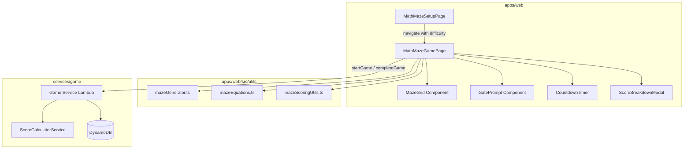

# Math Maze Game — Technical Design

## Overview

Math Maze is a new educational game for DashDen that combines procedural maze navigation with math problem-solving. Players navigate a grid-based maze where certain paths are blocked by math gates. Solving the equation opens the gate; a wrong answer permanently blocks that path, forcing the player to find an alternative route. The game rewards speed, accuracy, and exploration through collectible bonus items.

The game follows the established DashDen pattern: `SetupPage → GamePage → ScoreBreakdownModal → Hub/Leaderboard`. It integrates with the existing Game Service (startGame/completeGame mutations), uses the shared ScoreBreakdownModal, and registers in the game catalog under themeId `MATH_MAZE`.

Key technical challenges:
- Procedural maze generation guaranteeing multiple paths to the exit
- Math equation generation scaling across three difficulty levels (including simple algebra for Hard)
- Real-time game state management (player position, gate states, timer, collectibles)
- Responsive grid rendering for 320px–1920px viewports with touch/swipe support

## Architecture



The architecture keeps all maze logic (generation, equations, movement, scoring) as pure utility functions in `apps/web/src/utils/`, making them independently testable. The React components handle rendering and user interaction. The backend integration reuses the existing `startGame`/`completeGame` API with themeId `MATH_MAZE`.

## Components and Interfaces

### Pages

**MathMazeSetupPage** (`apps/web/src/pages/math-maze/MathMazeSetupPage.tsx`)
- Displays three difficulty cards (Easy/Medium/Hard) with descriptions
- Start button disabled until difficulty selected
- Navigates to `/math-maze/game?difficulty={easy|medium|hard}`
- Follows the same pattern as `MathSetupPage`

**MathMazeGamePage** (`apps/web/src/pages/math-maze/MathMazeGamePage.tsx`)
- Orchestrates game state: maze data, player position, timer, score, gate states
- Calls `startGame({ themeId: 'MATH_MAZE', difficulty })` on mount
- Handles keyboard (arrow keys) and touch (swipe) input
- Detects game-over conditions: exit reached, timer expired, no path available
- Calls `completeGame(...)` on game end, shows `ScoreBreakdownModal`

### Components

**MazeGrid** (`apps/web/src/components/math-maze/MazeGrid.tsx`)
```typescript
interface MazeGridProps {
  maze: MazeData
  playerPosition: Position
  gateStates: Map<string, GateState>  // 'row-col' -> state
  collectedItems: Set<string>          // 'row-col' of collected
  onCellClick?: (pos: Position) => void // optional tap-to-move for mobile
}
```
- Renders the grid using CSS Grid with Tailwind
- Cell size adapts to viewport: `min(cellSize, (viewportWidth - padding) / cols)`
- Cell types rendered with distinct colors/icons: wall (dark), path (light), gate (yellow/red), collectible (star), start (green), exit (flag)

**GatePrompt** (`apps/web/src/components/math-maze/GatePrompt.tsx`)
```typescript
interface GatePromptProps {
  equation: MathEquation
  onSubmit: (answer: number) => void
  onClose: () => void
  feedback?: { correct: boolean; correctAnswer?: number }
}
```
- Modal overlay with equation display and numeric input
- Auto-focuses input field
- Shows feedback (correct/incorrect with correct answer) for 2 seconds
- Keyboard-accessible with visible focus indicators

### Utility Modules

**mazeGenerator.ts** (`apps/web/src/utils/mazeGenerator.ts`)
```typescript
interface MazeConfig {
  rows: number
  cols: number
  gateCount: { min: number; max: number }
  collectibleCount: { min: number; max: number }
}

interface MazeData {
  grid: CellType[][]        // 2D array of cell types
  start: Position
  exit: Position
  gates: GateInfo[]          // gate positions + equations
  collectibles: Position[]   // collectible positions
  rows: number
  cols: number
}

type CellType = 'wall' | 'path' | 'gate' | 'collectible' | 'start' | 'exit'

interface Position { row: number; col: number }

interface GateInfo {
  position: Position
  equation: MathEquation
}

function generateMaze(difficulty: DifficultyLevel): MazeData
function getConfigForDifficulty(difficulty: DifficultyLevel): MazeConfig
```

Algorithm: Modified recursive backtracker
1. Initialize grid with all walls
2. Carve paths using recursive backtracker from a random cell
3. Place start at top-left region, exit at bottom-right region
4. Identify candidate gate positions (path cells that are chokepoints on some but not all paths)
5. Place gates ensuring at least 2 distinct paths from start to exit remain after any single gate is blocked
6. Place collectibles on non-critical path cells (cells not on any shortest path from start to exit)
7. Validate: BFS confirms ≥2 distinct paths exist

**mazeEquations.ts** (`apps/web/src/utils/mazeEquations.ts`)
```typescript
type MazeOperation = 'addition' | 'subtraction' | 'multiplication' | 'division' | 'power' | 'root' | 'algebra'

interface MathEquation {
  display: string       // e.g., "3x + 5 = 20, x = ?"
  answer: number        // e.g., 5
  operation: MazeOperation
}

interface EquationConfig {
  operations: MazeOperation[]
  maxOperand: number
}

function generateEquation(difficulty: DifficultyLevel): MathEquation
function getEquationConfig(difficulty: DifficultyLevel): EquationConfig
function checkEquationAnswer(equation: MathEquation, answer: number): boolean
```

Difficulty scaling:
- Easy: addition, subtraction; operands 1–20; integer answers only
- Medium: +, −, ×, ÷; operands 1–50; integer answers only (division generates clean quotients)
- Hard: all of Medium plus powers (base 2–10, exp 2–3), square roots (perfect squares 4–144), simple algebra (ax + b = c where a,b,c are small integers)

**mazeScoringUtils.ts** (`apps/web/src/utils/mazeScoringUtils.ts`)
```typescript
interface MazeGameResult {
  difficulty: DifficultyLevel
  completionTime: number      // seconds elapsed
  totalTime: number           // total allowed time
  gatesAttempted: number
  gatesSolved: number
  collectiblesGathered: number
  totalCollectibles: number
  reachedExit: boolean
}

interface MazeScoreBreakdown {
  baseScore: number
  difficultyMultiplier: number
  speedBonus: number
  accuracyBonus: number
  collectibleBonus: number
  finalScore: number
}

function calculateMazeScore(result: MazeGameResult): MazeScoreBreakdown
```

Score formula:
- Base: 1000
- Difficulty Multiplier: Easy=1.0, Medium=1.5, Hard=2.0
- Speed Bonus: `max(0.1, 1 + (totalTime - completionTime) / totalTime)`
- Accuracy Bonus: `1 + (gatesSolved / max(1, gatesAttempted)) * 0.5`
- Collectible Bonus: `collectiblesGathered * 50` (flat bonus per collectible)
- Final: `round(1000 × DifficultyMultiplier × SpeedBonus × AccuracyBonus) + CollectibleBonus`

## Data Models

### Game State (Frontend — React state in MathMazeGamePage)

```typescript
interface MathMazeGameState {
  gameId: string
  difficulty: DifficultyLevel
  maze: MazeData
  playerPosition: Position
  gateStates: Map<string, GateState>   // key: 'row-col'
  collectedItems: Set<string>           // key: 'row-col'
  timeRemaining: number
  gatesAttempted: number
  gatesSolved: number
  gameStatus: 'loading' | 'playing' | 'gate-prompt' | 'submitting' | 'completed'
  activeGate: GateInfo | null
  completionReason?: 'exit-reached' | 'time-up' | 'no-path'
}

type GateState = 'locked' | 'open' | 'blocked'
type DifficultyLevel = 'easy' | 'medium' | 'hard'
```

### Difficulty Configuration

```typescript
const MAZE_DIFFICULTY_CONFIG = {
  easy: {
    rows: 7, cols: 7,
    gates: { min: 3, max: 5 },
    collectibles: { min: 3, max: 5 },
    timeLimit: 180,
    difficultyNum: 1,
    operations: ['addition', 'subtraction'],
    maxOperand: 20,
  },
  medium: {
    rows: 10, cols: 10,
    gates: { min: 5, max: 8 },
    collectibles: { min: 4, max: 6 },
    timeLimit: 240,
    difficultyNum: 2,
    operations: ['addition', 'subtraction', 'multiplication', 'division'],
    maxOperand: 50,
  },
  hard: {
    rows: 13, cols: 13,
    gates: { min: 8, max: 12 },
    collectibles: { min: 5, max: 8 },
    timeLimit: 300,
    difficultyNum: 3,
    operations: ['addition', 'subtraction', 'multiplication', 'division', 'power', 'root', 'algebra'],
    maxOperand: 50,
  },
} as const
```

### Backend Integration

Uses existing `startGame` / `completeGame` mutations:

```typescript
// Start
startGame({ themeId: 'MATH_MAZE', difficulty: 1 | 2 | 3 })

// Complete
completeGame({
  gameId: string,
  completionTime: number,
  attempts: gatesAttempted,
  correctAnswers: gatesSolved,
  totalQuestions: totalGatesInMaze,
})
```

### Game Catalog Entry (DynamoDB seed)

```json
{
  "gameId": "math-maze",
  "title": "Math Maze",
  "description": "Navigate a maze by solving math equations at gates!",
  "icon": "🧮",
  "route": "/math-maze/setup",
  "status": "ACTIVE",
  "displayOrder": 16,
  "ageRange": "6-14",
  "category": "Science & Math"
}
```

### i18n Key Structure

All keys under `mathMaze` namespace:

```json
{
  "mathMaze": {
    "title": "Math Maze",
    "subtitle": "Solve equations to find your way!",
    "chooseLevel": "Choose Your Level",
    "easyDesc": "Addition & subtraction, small maze, 3 min",
    "mediumDesc": "All 4 operations, medium maze, 4 min",
    "hardDesc": "Advanced math & algebra, large maze, 5 min",
    "startGame": "Enter the Maze!",
    "selectLevel": "Select a Level",
    "gatePrompt": "Solve to open the gate:",
    "submitAnswer": "Submit",
    "correct": "Correct! Gate opened!",
    "incorrect": "Wrong! The answer was {{answer}}. Path blocked!",
    "timeUp": "Time's Up!",
    "mazeComplete": "Maze Complete!",
    "noPath": "No Path Available!",
    "gatesLabel": "Gates",
    "collectiblesLabel": "Stars",
    "timerLabel": "Time",
    "scoreLabel": "Score",
    "collected": "{{collected}} / {{total}}"
  }
}
```

### Routing

Add to `constants.ts`:
```typescript
MATH_MAZE_SETUP: '/math-maze/setup',
MATH_MAZE_GAME: '/math-maze/game',
```

Add to `App.tsx`:
```typescript
import MathMazeSetupPage from './pages/math-maze/MathMazeSetupPage'
import MathMazeGamePage from './pages/math-maze/MathMazeGamePage'
// ...
<Route path={ROUTES.MATH_MAZE_SETUP} element={<MathMazeSetupPage />} />
<Route path={ROUTES.MATH_MAZE_GAME} element={<MathMazeGamePage />} />
```

Add to `GameHubPage.tsx` filter map:
```typescript
'math-maze': 'Science & Math',
```


## Correctness Properties

*A property is a characteristic or behavior that should hold true across all valid executions of a system — essentially, a formal statement about what the system should do. Properties serve as the bridge between human-readable specifications and machine-verifiable correctness guarantees.*

### Property 1: Maze structural invariant — exactly one start and one exit

*For any* difficulty level, a generated maze SHALL contain exactly one cell of type `start` and exactly one cell of type `exit`.

**Validates: Requirements 2.1**

### Property 2: Maze path guarantee — at least two distinct paths

*For any* generated maze, there SHALL exist at least two distinct paths from the start cell to the exit cell (where "distinct" means they differ in at least one intermediate cell).

**Validates: Requirements 2.2**

### Property 3: Maze dimensions and content scale with difficulty

*For any* difficulty level, the generated maze SHALL have the correct grid dimensions, gate count within the specified range, and collectible count within the specified range for that difficulty.

**Validates: Requirements 2.3, 2.4, 2.5, 6.1**

### Property 4: Collectibles are placed on non-critical paths

*For any* generated maze, every collectible cell SHALL NOT lie on any shortest path from start to exit — collecting them requires an optional detour.

**Validates: Requirements 2.6**

### Property 5: Player movement validity

*For any* maze state, player position, and move direction, the player's position SHALL change if and only if the target cell is a walkable cell (path, open gate, collectible, start, or exit) — walls and blocked gates SHALL not be entered.

**Validates: Requirements 3.1, 3.3, 3.4**

### Property 6: Gate answer determines outcome

*For any* math gate and submitted answer, the gate SHALL transition to `open` if the answer is correct, and to `blocked` if the answer is incorrect. No other transitions are possible.

**Validates: Requirements 4.2, 4.3**

### Property 7: Equation generation respects difficulty constraints

*For any* difficulty level, every generated equation SHALL use only the allowed operations for that difficulty and operands within the allowed range, and the answer SHALL always be an integer.

**Validates: Requirements 4.6, 4.7, 4.8**

### Property 8: No-path detection correctness

*For any* maze state where no unblocked path exists from the player's current position to the exit, the game SHALL detect this condition (i.e., `hasPathToExit` returns false).

**Validates: Requirements 5.6**

### Property 9: Score calculation formula correctness

*For any* valid game result (difficulty, completionTime, gatesAttempted, gatesSolved, collectiblesGathered), the computed score SHALL equal `round(1000 × DifficultyMultiplier × SpeedBonus × AccuracyBonus) + collectiblesGathered × 50`, where each component follows its defined formula.

**Validates: Requirements 7.1, 7.2, 7.3, 7.4, 7.5**

### Property 10: Collectible pickup awards points and removes item

*For any* maze state where the player moves onto a collectible cell, the collectible SHALL be removed from the grid and the collected count SHALL increase by exactly one.

**Validates: Requirements 6.2**

## Error Handling

| Scenario | Handling |
|---|---|
| `startGame` mutation fails (network) | Show error toast, navigate back to setup page |
| `startGame` returns rate limit error | Redirect to `ROUTES.RATE_LIMIT` (same as other games) |
| `completeGame` mutation fails | Log error, still show local score breakdown (calculate client-side) |
| Maze generation exceeds 500ms | Unlikely for 13×13 grid, but add a timeout fallback that retries with a simpler seed |
| Invalid difficulty in URL params | Default to 'easy' |
| Player submits non-numeric input in gate prompt | Disable submit button for empty/non-numeric input; HTML `type="number"` handles this |
| All paths blocked (no-path condition) | End game immediately with "No Path Available" message and score what was earned |
| Browser tab loses focus during game | Timer continues (same behavior as Math Challenge) |

## Testing Strategy

### Unit Tests (Example-Based)

- **SetupPage**: Renders 3 difficulty options; Start button disabled when none selected; navigates with correct query param
- **MazeGrid rendering**: Correct cell types rendered; player avatar visible at position; responsive sizing
- **GatePrompt**: Displays equation; auto-focuses input; shows feedback for 2 seconds; keyboard accessible
- **Timer display**: Correct MM:SS format; red color at ≤30s; game ends at 0
- **Game completion**: ScoreBreakdownModal shown with correct data; correct completion messages per reason
- **i18n**: All user-facing strings use translation keys; en/es/pt files contain all `mathMaze.*` keys
- **Accessibility**: ARIA labels on grid, gate prompt, timer, score; focus indicators on interactive elements
- **Touch/swipe**: Swipe gestures map to correct directions

### Property-Based Tests (fast-check)

Library: `fast-check` (already available in the project ecosystem or easily added)
Minimum 100 iterations per property.

Each property test references its design property:

```
// Feature: math-maze-game, Property 1: Maze structural invariant
// Feature: math-maze-game, Property 2: Maze path guarantee
// Feature: math-maze-game, Property 3: Maze dimensions and content scale with difficulty
// Feature: math-maze-game, Property 4: Collectibles on non-critical paths
// Feature: math-maze-game, Property 5: Player movement validity
// Feature: math-maze-game, Property 6: Gate answer determines outcome
// Feature: math-maze-game, Property 7: Equation generation respects difficulty constraints
// Feature: math-maze-game, Property 8: No-path detection correctness
// Feature: math-maze-game, Property 9: Score calculation formula correctness
// Feature: math-maze-game, Property 10: Collectible pickup awards points and removes item
```

Properties 1–4 test `generateMaze()` — pure function, no mocks needed.
Properties 5, 6, 8, 10 test game state transition functions — pure logic extracted from React state.
Property 7 tests `generateEquation()` — pure function.
Property 9 tests `calculateMazeScore()` — pure function.

### Integration Tests

- `startGame` with themeId `MATH_MAZE` creates session (1–2 examples)
- `completeGame` records result and returns score breakdown (1–2 examples)
- Game catalog entry exists with correct fields
- Rate limiting applies to MATH_MAZE sessions
