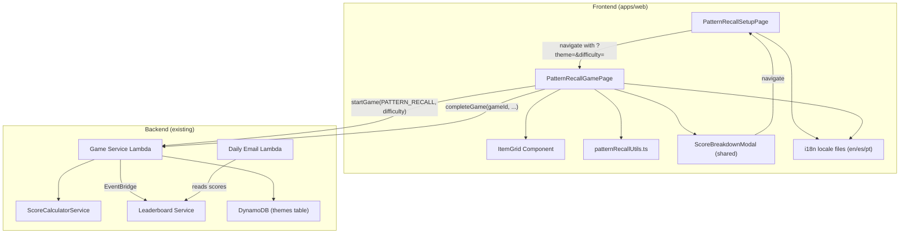

# Design Document — Pattern Recall Game

## Overview

The Pattern Recall game is a Simon Says-style memory game for DashDen where players memorize and reproduce sequences of themed items. It follows the established DashDen game architecture: a **SetupPage** for configuration → a **GamePage** for gameplay → the shared **ScoreBreakdownModal** for results → integration with the leaderboard, scoring, i18n, and daily email systems.

The game loop works as follows: each round, the system plays back a sequence by highlighting grid items one at a time. The player then reproduces the sequence by tapping items in order. Each successful round extends the sequence by one item. A wrong tap ends the game immediately. The player's score is computed using the standard DashDen formula and submitted to the leaderboard.

### Key Design Decisions

1. **Pure utility module for game logic** — All game logic (sequence generation, tap validation, theme data, difficulty config) lives in `patternRecallUtils.ts`, keeping components thin and logic easily testable.
2. **URL query parameters for game config** — Theme and difficulty are passed via URL params (matching the existing pattern in MathGamePage, SequenceMemoryGamePage), enabling deep linking and browser back/forward support.
3. **Single wrong tap = game over** — Unlike Sequence Memory which has lives, Pattern Recall ends immediately on a wrong tap (classic Simon Says behavior). This simplifies state management and makes accuracy critical.
4. **Reuse existing infrastructure** — No new backend services needed. The game uses the existing `startGame`/`completeGame` API, `ScoreBreakdownModal`, `ScoreCalculatorService`, and leaderboard pipeline.

## Architecture



### File Structure

```
apps/web/src/
├── pages/pattern-recall/
│   ├── PatternRecallSetupPage.tsx    # Theme + difficulty selection
│   └── PatternRecallGamePage.tsx     # Main gameplay loop
├── utils/
│   └── patternRecallUtils.ts         # Game logic, theme data, config
├── locales/
│   ├── en.json                       # + patternRecall keys
│   ├── es.json                       # + patternRecall keys
│   └── pt.json                       # + patternRecall keys
├── config/
│   └── constants.ts                  # + PATTERN_RECALL_SETUP, PATTERN_RECALL_GAME routes
└── App.tsx                           # + route entries

services/game/src/
├── services/game.service.ts          # + PATTERN_RECALL in themeId arrays
└── daily-email.ts                    # + PATTERN_RECALL in ALL_GAMES, GAME_NAMES

services/leaderboard/src/
└── types/index.ts                    # + PATTERN_RECALL in GameType enum

apps/web/src/
├── api/leaderboard.ts                # + PATTERN_RECALL in GameType enum
├── components/leaderboard/GameTypeFilter.tsx  # + Pattern Recall option
└── components/dashboard/RecentImprovements.tsx # + PATTERN_RECALL entry
```

## Components and Interfaces

### PatternRecallSetupPage

**Location:** `apps/web/src/pages/pattern-recall/PatternRecallSetupPage.tsx`

Follows the same pattern as `MathSetupPage` and `SequenceMemorySetupPage`. Displays theme cards and difficulty cards. Navigates to the game page with query parameters.

**State:**
- `selectedTheme: PatternRecallTheme | null`
- `selectedDifficulty: PatternRecallDifficulty | null`

**Behavior:**
- Renders 4 theme cards (Colors, Animals, Musical Notes, Emojis) with emoji icons and descriptions
- Renders 3 difficulty cards (Easy, Medium, Hard) with descriptions showing playback speed and item count
- Start button is disabled until both theme and difficulty are selected
- On start: navigates to `ROUTES.PATTERN_RECALL_GAME + ?theme=${theme}&difficulty=${difficulty}`
- All text uses `t()` from react-i18next with keys under `patternRecall.setup.*`

### PatternRecallGamePage

**Location:** `apps/web/src/pages/pattern-recall/PatternRecallGamePage.tsx`

The main gameplay component. Manages the game state machine and coordinates with the backend API.

**State:**
```typescript
type GamePhase = 'loading' | 'playback' | 'input' | 'correct' | 'game-over' | 'submitting' | 'completed'

// Component state
gameId: string
phase: GamePhase
sequence: number[]           // indices into the theme's items array
currentPlaybackIndex: number // which item in the sequence is being highlighted
currentInputIndex: number    // which item the player needs to tap next
roundNumber: number          // current round (1-based)
timer: number                // elapsed seconds
scoreBreakdown: ScoreBreakdown | null
leaderboardRank: number | null
totalTaps: number            // total taps made (for attempts param)
```

**Lifecycle:**
1. **Loading** — Read theme/difficulty from URL params. Call `startGame({ themeId: 'PATTERN_RECALL', difficulty })`. On rate limit error, redirect to rate limit page. On success, store `gameId`, generate initial sequence, start timer, transition to playback.
2. **Playback** — Animate items in sequence one at a time. Grid items are disabled. After last item, pause briefly, then transition to input.
3. **Input** — Grid items are enabled. Player taps items. Each tap is validated against `sequence[currentInputIndex]`.
   - Correct tap: green flash, advance `currentInputIndex`. If all items matched, show "correct" briefly, extend sequence, transition to playback.
   - Wrong tap: red flash, transition to game-over.
4. **Game Over** — Show overlay with rounds completed and time. "See Score" button triggers score submission.
5. **Submitting** — Call `completeGame(...)`. Show loading spinner.
6. **Completed** — Show `ScoreBreakdownModal`.

### ItemGrid Component

**Location:** Inline within `PatternRecallGamePage.tsx` (not a separate file — follows the pattern of other DashDen games where grid rendering is part of the game page).

**Props (conceptual, implemented as part of game page):**
- `items: ThemeItem[]` — The theme's items to display
- `activeIndex: number | null` — Which item is currently highlighted during playback
- `disabled: boolean` — Whether taps are accepted
- `onTap: (index: number) => void` — Tap handler
- `feedbackIndex: number | null` — Which item to show feedback on
- `feedbackType: 'correct' | 'wrong' | null`

**Rendering:**
- Items arranged in a responsive flex/grid layout
- Each item is a `<button>` with:
  - The theme's visual (colored div, emoji, or icon)
  - ARIA label describing the item (e.g., "Red", "Dog", "Quarter Note", "😀")
  - `aria-disabled` when in playback phase
  - Keyboard focusable with `tabIndex={0}`
- Animation states:
  - **Idle:** Default appearance
  - **Active (playback):** Scale up + brightness/glow + ring highlight (CSS transition)
  - **Correct tap:** Brief green ring flash (200ms)
  - **Wrong tap:** Brief red ring flash (200ms)
- Layout adapts: 2×2 for 4 items, 3+2 or 2+3 for 5 items, 3×2 for 6 items
- Items scale proportionally to viewport width (min 64px, max 120px)

### Utility Module: patternRecallUtils.ts

**Location:** `apps/web/src/utils/patternRecallUtils.ts`

Pure functions and data definitions. No React dependencies. Fully unit-testable.

```typescript
// ── Types ──────────────────────────────────────────────────────────────

export type PatternRecallTheme = 'colors' | 'animals' | 'musical-notes' | 'emojis'
export type PatternRecallDifficulty = 'easy' | 'medium' | 'hard'

export interface ThemeItem {
  id: string
  label: string        // i18n key for the item name
  visual: string       // CSS color hex, emoji, or icon identifier
  type: 'color' | 'emoji' | 'icon'
}

export interface ThemeConfig {
  id: PatternRecallTheme
  labelKey: string     // i18n key for theme name
  icon: string         // emoji for theme card
  items: ThemeItem[]   // all available items (6 max, sliced by difficulty)
}

export interface DifficultyConfig {
  id: PatternRecallDifficulty
  labelKey: string     // i18n key
  descriptionKey: string
  itemCount: number    // 4, 5, or 6
  playbackSpeed: number // ms per item
  difficultyValue: number // 1, 2, or 3 (for API)
}

// ── Theme Data ─────────────────────────────────────────────────────────

export const THEMES: Record<PatternRecallTheme, ThemeConfig>
export const DIFFICULTIES: Record<PatternRecallDifficulty, DifficultyConfig>

// ── Functions ──────────────────────────────────────────────────────────

/** Get the items for a given theme and difficulty (slices to itemCount) */
export function getGridItems(theme: PatternRecallTheme, difficulty: PatternRecallDifficulty): ThemeItem[]

/** Generate the initial sequence (length 1) with a random item index */
export function generateInitialSequence(itemCount: number): number[]

/** Extend an existing sequence by appending one random item index */
export function extendSequence(sequence: number[], itemCount: number): number[]

/** Validate a single tap: returns true if the tapped index matches the expected */
export function validateTap(sequence: number[], inputIndex: number, tappedIndex: number): boolean

/** Get the playback speed for a difficulty */
export function getPlaybackSpeed(difficulty: PatternRecallDifficulty): number

/** Get the difficulty numeric value for the API */
export function getDifficultyValue(difficulty: PatternRecallDifficulty): number
```

## Data Models

### Theme Definitions

```typescript
export const THEMES: Record<PatternRecallTheme, ThemeConfig> = {
  colors: {
    id: 'colors',
    labelKey: 'patternRecall.themes.colors',
    icon: '🎨',
    items: [
      { id: 'red',    label: 'patternRecall.items.red',    visual: '#EF4444', type: 'color' },
      { id: 'blue',   label: 'patternRecall.items.blue',   visual: '#3B82F6', type: 'color' },
      { id: 'green',  label: 'patternRecall.items.green',  visual: '#22C55E', type: 'color' },
      { id: 'yellow', label: 'patternRecall.items.yellow', visual: '#EAB308', type: 'color' },
      { id: 'purple', label: 'patternRecall.items.purple', visual: '#A855F7', type: 'color' },
      { id: 'orange', label: 'patternRecall.items.orange', visual: '#F97316', type: 'color' },
    ],
  },
  animals: {
    id: 'animals',
    labelKey: 'patternRecall.themes.animals',
    icon: '🐾',
    items: [
      { id: 'dog',     label: 'patternRecall.items.dog',     visual: '🐶', type: 'emoji' },
      { id: 'cat',     label: 'patternRecall.items.cat',     visual: '🐱', type: 'emoji' },
      { id: 'rabbit',  label: 'patternRecall.items.rabbit',  visual: '🐰', type: 'emoji' },
      { id: 'bear',    label: 'patternRecall.items.bear',    visual: '🐻', type: 'emoji' },
      { id: 'fox',     label: 'patternRecall.items.fox',     visual: '🦊', type: 'emoji' },
      { id: 'penguin', label: 'patternRecall.items.penguin', visual: '🐧', type: 'emoji' },
    ],
  },
  'musical-notes': {
    id: 'musical-notes',
    labelKey: 'patternRecall.themes.musicalNotes',
    icon: '🎵',
    items: [
      { id: 'quarter',  label: 'patternRecall.items.quarterNote',  visual: '🎵', type: 'emoji' },
      { id: 'eighth',   label: 'patternRecall.items.eighthNote',   visual: '🎶', type: 'emoji' },
      { id: 'trumpet',  label: 'patternRecall.items.trumpet',      visual: '🎺', type: 'emoji' },
      { id: 'guitar',   label: 'patternRecall.items.guitar',       visual: '🎸', type: 'emoji' },
      { id: 'drum',     label: 'patternRecall.items.drum',         visual: '🥁', type: 'emoji' },
      { id: 'piano',    label: 'patternRecall.items.piano',        visual: '🎹', type: 'emoji' },
    ],
  },
  emojis: {
    id: 'emojis',
    labelKey: 'patternRecall.themes.emojis',
    icon: '😀',
    items: [
      { id: 'smile',   label: 'patternRecall.items.smile',   visual: '😀', type: 'emoji' },
      { id: 'heart',   label: 'patternRecall.items.heart',   visual: '❤️', type: 'emoji' },
      { id: 'star',    label: 'patternRecall.items.star',    visual: '⭐', type: 'emoji' },
      { id: 'fire',    label: 'patternRecall.items.fire',    visual: '🔥', type: 'emoji' },
      { id: 'rainbow', label: 'patternRecall.items.rainbow', visual: '🌈', type: 'emoji' },
      { id: 'rocket',  label: 'patternRecall.items.rocket',  visual: '🚀', type: 'emoji' },
    ],
  },
}
```

### Difficulty Configuration

```typescript
export const DIFFICULTIES: Record<PatternRecallDifficulty, DifficultyConfig> = {
  easy: {
    id: 'easy',
    labelKey: 'patternRecall.difficulty.easy',
    descriptionKey: 'patternRecall.difficulty.easyDesc',
    itemCount: 4,
    playbackSpeed: 800,
    difficultyValue: 1,
  },
  medium: {
    id: 'medium',
    labelKey: 'patternRecall.difficulty.medium',
    descriptionKey: 'patternRecall.difficulty.mediumDesc',
    itemCount: 5,
    playbackSpeed: 600,
    difficultyValue: 2,
  },
  hard: {
    id: 'hard',
    labelKey: 'patternRecall.difficulty.hard',
    descriptionKey: 'patternRecall.difficulty.hardDesc',
    itemCount: 6,
    playbackSpeed: 400,
    difficultyValue: 3,
  },
}
```

### Game State Interface

```typescript
interface PatternRecallGameState {
  gameId: string
  theme: PatternRecallTheme
  difficulty: PatternRecallDifficulty
  phase: GamePhase
  items: ThemeItem[]           // grid items for current theme+difficulty
  sequence: number[]           // item indices in play order
  currentPlaybackIndex: number // -1 when not in playback
  currentInputIndex: number    // 0-based position player needs to tap next
  roundNumber: number          // 1-based
  timer: number                // elapsed seconds
  totalTaps: number            // all taps made (correct + wrong)
  feedbackItem: number | null  // index of item showing feedback
  feedbackType: 'correct' | 'wrong' | null
  scoreBreakdown: ScoreBreakdown | null
  leaderboardRank: number | null
}
```

## Backend Integration

### startGame Call

```typescript
// On GamePage mount
const game = await startGame({
  themeId: 'PATTERN_RECALL',
  difficulty: getDifficultyValue(difficulty), // 1, 2, or 3
})
// Store game.id for completeGame call
```

### completeGame Call

```typescript
// On "See Score" click from game-over overlay
const result = await completeGame({
  gameId,
  completionTime: timer,                    // total seconds elapsed
  attempts: totalTaps,                       // all taps made
  correctAnswers: roundNumber - 1,           // rounds completed (0-indexed from round 1)
  totalQuestions: roundNumber,               // rounds completed + 1 (the failed round)
})
```

### Backend Changes Required

1. **game.service.ts** — Add `'PATTERN_RECALL'` to the themeId validation arrays (two locations: attempts validation skip list and accuracy calculation list).

2. **Leaderboard GameType enum** (`services/leaderboard/src/types/index.ts`) — Add `PATTERN_RECALL = 'PATTERN_RECALL'`.

3. **Frontend GameType enum** (`apps/web/src/api/leaderboard.ts`) — Add `PATTERN_RECALL = 'PATTERN_RECALL'`.

4. **DynamoDB themes table** — Seed a `PATTERN_RECALL` entry with status `PUBLISHED`:
   ```json
   {
     "themeId": "PATTERN_RECALL",
     "name": "Pattern Recall",
     "status": "PUBLISHED"
   }
   ```

5. **Daily Email Lambda** (`services/game/src/daily-email.ts`) — Add `'PATTERN_RECALL'` to `ALL_GAMES` array and `PATTERN_RECALL: '🧩 Pattern Recall'` to `GAME_NAMES` map.

### Leaderboard Frontend Integration

1. **GameTypeFilter.tsx** — Add entry:
   ```typescript
   { value: GameType.PATTERN_RECALL, label: 'Pattern Recall', icon: '🧩' }
   ```

2. **RecentImprovements.tsx** — Add entry to `gameTypeInfo`:
   ```typescript
   [GameType.PATTERN_RECALL]: { icon: '🧩', name: 'Pattern Recall' }
   ```

3. **GameHubPage.tsx** — Add to `GAME_FILTER_MAP`:
   ```typescript
   'pattern-recall': 'Puzzles & Logic'
   ```

## Routing Configuration

### constants.ts additions

```typescript
PATTERN_RECALL_SETUP: '/pattern-recall/setup',
PATTERN_RECALL_GAME: '/pattern-recall/game',
```

### App.tsx additions

```tsx
import PatternRecallSetupPage from './pages/pattern-recall/PatternRecallSetupPage'
import PatternRecallGamePage from './pages/pattern-recall/PatternRecallGamePage'

// Inside protected routes:
<Route path={ROUTES.PATTERN_RECALL_SETUP} element={<PatternRecallSetupPage />} />
<Route path={ROUTES.PATTERN_RECALL_GAME} element={<PatternRecallGamePage />} />
```

## i18n Key Structure

Keys are added under a `patternRecall` namespace in each locale file.

```json
{
  "patternRecall": {
    "setup": {
      "title": "Pattern Recall",
      "subtitle": "Memorize and repeat the pattern!",
      "chooseTheme": "Choose a Theme",
      "chooseDifficulty": "Choose Difficulty",
      "startGame": "Start Game! 🧩",
      "selectBoth": "Select theme & difficulty"
    },
    "themes": {
      "colors": "Colors",
      "animals": "Animals",
      "musicalNotes": "Musical Notes",
      "emojis": "Emojis"
    },
    "difficulty": {
      "easy": "Easy",
      "medium": "Medium",
      "hard": "Hard",
      "easyDesc": "Slower playback, 4 items",
      "mediumDesc": "Medium speed, 5 items",
      "hardDesc": "Fast playback, 6 items"
    },
    "game": {
      "round": "Round {{current}}",
      "time": "Time",
      "watchPattern": "Watch the pattern!",
      "yourTurn": "Your turn!",
      "correct": "Correct!",
      "nextRound": "Next round...",
      "gameOver": "Game Over!",
      "roundsCompleted": "Rounds completed: {{count}}",
      "totalTime": "Total time: {{time}}",
      "seeScore": "See Score 🏆",
      "tryAgain": "Try Again"
    },
    "items": {
      "red": "Red",
      "blue": "Blue",
      "green": "Green",
      "yellow": "Yellow",
      "purple": "Purple",
      "orange": "Orange",
      "dog": "Dog",
      "cat": "Cat",
      "rabbit": "Rabbit",
      "bear": "Bear",
      "fox": "Fox",
      "penguin": "Penguin",
      "quarterNote": "Quarter Note",
      "eighthNote": "Eighth Note",
      "trumpet": "Trumpet",
      "guitar": "Guitar",
      "drum": "Drum",
      "piano": "Piano",
      "smile": "Smile",
      "heart": "Heart",
      "star": "Star",
      "fire": "Fire",
      "rainbow": "Rainbow",
      "rocket": "Rocket"
    }
  }
}
```

Spanish (`es.json`) and Portuguese (`pt.json`) will mirror this structure with translated values.

## Correctness Properties

*A property is a characteristic or behavior that should hold true across all valid executions of a system — essentially, a formal statement about what the system should do. Properties serve as the bridge between human-readable specifications and machine-verifiable correctness guarantees.*

### Property 1: Difficulty configuration maps to correct item count and playback speed

*For any* valid difficulty level (easy, medium, hard), the `DIFFICULTIES` config should return the correct item count (4, 5, 6 respectively) and the correct playback speed (800ms, 600ms, 400ms respectively), and the difficulty API value should be (1, 2, 3 respectively).

**Validates: Requirements 3.1, 3.2, 3.3, 4.2, 4.3, 4.4**

### Property 2: Theme data provides sufficient distinct items for all difficulties

*For any* theme in the `THEMES` config, the theme should have at least 6 items (the maximum needed for hard difficulty), and all item IDs within a theme should be unique.

**Validates: Requirements 3.4, 3.5, 3.6, 3.7**

### Property 3: Sequence extension preserves prefix and appends one valid item

*For any* existing sequence of length N and any item count M (where M >= 2), extending the sequence should produce a new sequence of length N+1 where the first N elements are identical to the original sequence and the last element is a valid index in range [0, M).

**Validates: Requirements 5.1, 5.2**

### Property 4: Tap validation correctness

*For any* sequence of length N and any input position i (0 <= i < N), `validateTap` should return `true` if and only if the tapped index equals `sequence[i]`. For any tapped index that does not equal `sequence[i]`, it should return `false`.

**Validates: Requirements 6.2, 6.3**

### Property 5: Grid items are sliced correctly for theme and difficulty

*For any* combination of theme and difficulty, `getGridItems(theme, difficulty)` should return exactly `DIFFICULTIES[difficulty].itemCount` items, and those items should be the first N items from the theme's full item list.

**Validates: Requirements 3.1, 3.2, 3.3, 3.4, 3.5, 3.6, 3.7**

### Property 6: i18n key completeness across locales

*For any* i18n key referenced under the `patternRecall` namespace, that key should exist in all three locale files (en, es, pt) with a non-empty string value.

**Validates: Requirements 10.2**

## Error Handling

| Scenario | Handling |
|---|---|
| **startGame rate limit error** | Detect `RATE_LIMIT_EXCEEDED` error code or "Rate limit" message. Navigate to `ROUTES.RATE_LIMIT` with `{ state: { rateLimited: true } }`. |
| **startGame network/other error** | Log error to console. Navigate to `ROUTES.HUB`. |
| **completeGame failure** | Log error. Still transition to `completed` phase. Show fallback completion screen (rounds completed + time) without score breakdown. |
| **Invalid URL params** | If theme or difficulty param is missing or invalid, redirect to `ROUTES.PATTERN_RECALL_SETUP`. |
| **Browser back during gameplay** | Navigation to setup page (standard browser behavior). No special handling needed — game state is ephemeral. |

Error handling follows the exact patterns established in `MathGamePage.tsx` and `SequenceMemoryGamePage.tsx`.

## Testing Strategy

### Unit Tests (Vitest)

Focus on the pure utility functions in `patternRecallUtils.ts`:

- `getGridItems` returns correct items for each theme × difficulty combination
- `generateInitialSequence` returns a sequence of length 1 with a valid index
- `extendSequence` preserves prefix and appends a valid index
- `validateTap` returns correct boolean for matching and non-matching taps
- `getPlaybackSpeed` returns correct speed for each difficulty
- `getDifficultyValue` returns correct API value for each difficulty
- Theme data integrity: all themes have 6 items, all IDs unique

### Property-Based Tests (fast-check + Vitest)

Each correctness property is implemented as a property-based test using [fast-check](https://github.com/dubzzz/fast-check). Minimum 100 iterations per property.

- **Property 1:** Generate random difficulty, verify config mapping
  - Tag: `Feature: pattern-recall-game, Property 1: Difficulty configuration maps to correct item count and playback speed`
- **Property 2:** Generate random theme, verify item count >= 6 and unique IDs
  - Tag: `Feature: pattern-recall-game, Property 2: Theme data provides sufficient distinct items for all difficulties`
- **Property 3:** Generate random sequence length (0-50) and item count (2-6), verify extension behavior
  - Tag: `Feature: pattern-recall-game, Property 3: Sequence extension preserves prefix and appends one valid item`
- **Property 4:** Generate random sequence and input position, verify tap validation
  - Tag: `Feature: pattern-recall-game, Property 4: Tap validation correctness`
- **Property 5:** Generate random theme × difficulty, verify getGridItems output
  - Tag: `Feature: pattern-recall-game, Property 5: Grid items are sliced correctly for theme and difficulty`
- **Property 6:** Enumerate all patternRecall i18n keys, verify presence in all locales
  - Tag: `Feature: pattern-recall-game, Property 6: i18n key completeness across locales`

### Component Tests (Vitest + React Testing Library)

- **SetupPage:** Theme and difficulty selection, button disabled state, navigation on start
- **GamePage:** Phase transitions (loading → playback → input → game-over → completed), API calls with correct params, ScoreBreakdownModal rendering
- **Accessibility:** ARIA labels on grid items, keyboard navigation

### Integration Tests

- **Backend:** Verify `startGame` and `completeGame` accept `PATTERN_RECALL` themeId (existing test infrastructure)
- **Leaderboard:** Verify `PATTERN_RECALL` appears in GameType enum and filter dropdown
- **Smoke:** Verify DynamoDB themes table contains `PATTERN_RECALL` entry
