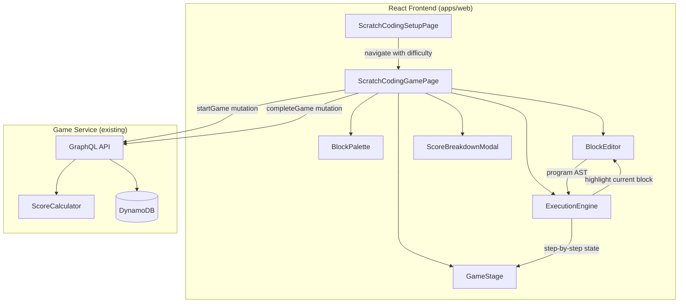

# Design Document: Scratch Coding Game

## Overview

The Scratch Coding Game is a new visual programming game for DashDen that teaches kids programming fundamentals through block-based coding challenges. Players drag categorized code blocks (motion, control, events) into a workspace to build programs that guide a character through grid-based levels. The game follows the established DashDen game pattern: SetupPage → GamePage → ScoreBreakdownModal → Hub/Leaderboard.

Unlike the existing Code-a-Bot game (which uses a flat instruction sequence of FORWARD/TURN/JUMP), this game introduces Scratch-style nested blocks with parameters — loops (`repeat N times`), conditionals (`if wall ahead`), and parameterized motion (`move N steps`, `turn left/right`). This enables teaching real programming concepts like iteration and branching.

The game is entirely frontend-driven (all level data, execution engine, and block logic live in the React app), integrating with the existing Game Service backend only for session tracking and scoring via `startGame`/`completeGame` GraphQL mutations.

## Architecture



The architecture is split into two layers:

1. **Frontend (new code)**: All game logic — block types, level definitions, drag-and-drop editor, execution engine, and rendering — lives in `apps/web/src/pages/scratch-coding/` and `apps/web/src/utils/scratchCodingUtils.ts`.

2. **Backend (existing)**: No backend changes needed. The game uses the existing `startGame` and `completeGame` mutations with `themeId: "SCRATCH_CODING"`. The Game Service catalog entry is seeded via DynamoDB.

## Components and Interfaces

### Page Components

#### ScratchCodingSetupPage
- **Path**: `apps/web/src/pages/scratch-coding/ScratchCodingSetupPage.tsx`
- **Responsibility**: Difficulty selection (Easy/Medium/Hard), how-to-play instructions, start button
- **Pattern**: Mirrors `CodeABotSetupPage` — displays difficulty cards, navigates to game page with `?difficulty=` query param
- **Props**: None (reads route, uses `useNavigate`, `useTranslation`)

#### ScratchCodingGamePage
- **Path**: `apps/web/src/pages/scratch-coding/ScratchCodingGamePage.tsx`
- **Responsibility**: Orchestrates the game — manages game state, level progression, timer, API calls
- **State**: `gameId`, `currentLevel`, `phase` (building | running | success | fail | submitting | completed), `program` (block AST), `timer`, `levelsCompleted`, `totalAttempts`, `scoreBreakdown`
- **Lifecycle**:
  1. On mount: calls `startGame({ themeId: 'SCRATCH_CODING', difficulty })` 
  2. During play: renders BlockPalette, BlockEditor, GameStage
  3. On run: passes program to ExecutionEngine, animates on GameStage
  4. On level complete/fail: shows overlay
  5. On game end: calls `completeGame(...)`, shows ScoreBreakdownModal

### Game Sub-Components

#### BlockPalette
- **Responsibility**: Displays available blocks organized by category, filtered by difficulty
- **Interface**: `{ difficulty: Difficulty, onBlockSelect: (blockType: BlockType) => void }`
- **Behavior**: Blocks are draggable. Categories color-coded: blue (Motion), orange (Control), yellow (Events). Easy shows Motion+Events only; Medium adds `repeat`; Hard adds `if/else` and nested loops.

#### BlockEditor
- **Responsibility**: Workspace where players assemble their program by dropping blocks
- **Interface**: `{ program: Block[], onProgramChange: (program: Block[]) => void, maxBlocks: number, highlightedBlockId: string | null, disabled: boolean }`
- **Behavior**: 
  - Accepts drops from BlockPalette, inserts at drop position
  - Shows snap indicators when dragging near existing blocks
  - Click-to-remove blocks
  - Numeric input fields on parameterized blocks (repeat count, move steps)
  - Displays block count vs max
  - Supports nesting (blocks inside repeat/if-else containers)

#### GameStage
- **Responsibility**: Renders the grid, character, goal, and obstacles; animates character movement
- **Interface**: `{ level: Level, characterPos: Position, characterDir: Direction, isAnimating: boolean }`
- **Behavior**: Scales grid to fit viewport. Character animates between positions during execution.

### Utility Module

#### scratchCodingUtils.ts
- **Path**: `apps/web/src/utils/scratchCodingUtils.ts`
- **Responsibility**: All pure game logic — block type definitions, level data, execution engine
- **Exports**:
  - Block type definitions and categories
  - Level definitions (5+ per difficulty)
  - `executeProgram(level, program)` → `ExecutionStep[]`
  - `getLevel(difficulty, levelNumber)` → `Level`
  - `getTotalLevels(difficulty)` → `number`
  - Difficulty config

### Drag-and-Drop Approach

**Recommendation: Use `@dnd-kit/core`** (with `@dnd-kit/sortable` for reordering within the editor).

Rationale:
- Lightweight, modern React DnD library built for accessibility
- First-class touch support (requirement 9.2)
- Keyboard-accessible drag operations (requirement 9.3)
- Tree-friendly — supports nested droppable containers (needed for repeat/if-else block nesting)
- No legacy peer dependencies (unlike `react-dnd` which requires `react-dnd-html5-backend` + `react-dnd-touch-backend`)
- Active maintenance, good TypeScript support

The BlockPalette items are `<Draggable>` sources. The BlockEditor is a `<Droppable>` container. Nested blocks (repeat body, if/else branches) are nested `<Droppable>` zones.

## Data Models

### Block Types

```typescript
type BlockCategory = 'motion' | 'control' | 'events'

type BlockType =
  // Events
  | 'ON_START'
  // Motion
  | 'MOVE_FORWARD'    // move N steps (default 1)
  | 'TURN_LEFT'       // turn left 90°
  | 'TURN_RIGHT'      // turn right 90°
  // Control (Medium+)
  | 'REPEAT'          // repeat N times { body }
  // Control (Hard)
  | 'IF_WALL_AHEAD'   // if wall ahead { body } else { body }
  | 'IF_ON_GOAL'      // if on goal { body }

interface BlockDefinition {
  type: BlockType
  category: BlockCategory
  label: string          // i18n key
  color: string          // Tailwind class
  hasParameter: boolean  // true for MOVE_FORWARD, REPEAT
  parameterDefault: number
  parameterMin: number
  parameterMax: number
  hasBody: boolean       // true for REPEAT, IF_WALL_AHEAD
  hasElseBody: boolean   // true for IF_WALL_AHEAD
  minDifficulty: Difficulty // 'easy' | 'medium' | 'hard'
}

// A block instance in the player's program (AST node)
interface Block {
  id: string             // unique ID for drag-and-drop tracking
  type: BlockType
  parameter?: number     // for MOVE_FORWARD (steps), REPEAT (count)
  body?: Block[]         // for REPEAT, IF_WALL_AHEAD (then branch)
  elseBody?: Block[]     // for IF_WALL_AHEAD (else branch)
}
```

### Level Data Structure

```typescript
type Difficulty = 'easy' | 'medium' | 'hard'
type CellType = 'empty' | 'wall' | 'goal'
type Direction = 'up' | 'right' | 'down' | 'left'

interface Position {
  row: number
  col: number
}

interface Level {
  grid: CellType[][]     // 2D grid
  rows: number
  cols: number
  start: Position
  startDir: Direction
  goal: Position
  maxBlocks: number      // max blocks allowed in program
  optimalBlocks: number  // fewest blocks for optimal solution
  levelNumber: number
  hint?: string          // i18n key
  availableBlocks: BlockType[]  // which blocks are available for this level
}

interface DifficultyConfig {
  label: string
  emoji: string
  description: string
  levelCount: number
  gridSize: number
  availableCategories: BlockCategory[]
}
```

### Execution Engine Types

```typescript
interface CharacterState {
  pos: Position
  dir: Direction
  alive: boolean
}

interface ExecutionStep {
  blockId: string        // which block produced this step
  pos: Position
  dir: Direction
  alive: boolean
  reachedGoal: boolean
  hitWall: boolean
  outOfBounds: boolean
}

// The engine interprets the Block AST recursively:
// - ON_START: execute children (the program body)
// - MOVE_FORWARD(n): move n steps in current direction, one step at a time
// - TURN_LEFT/RIGHT: rotate 90°
// - REPEAT(n, body): execute body n times
// - IF_WALL_AHEAD(body, elseBody): check cell ahead, branch accordingly
```

### Execution Engine Design

The execution engine is a recursive AST interpreter that walks the block tree and produces a flat array of `ExecutionStep[]` for animation.

```typescript
function executeProgram(level: Level, program: Block[]): ExecutionStep[] {
  const steps: ExecutionStep[] = []
  const state: CharacterState = {
    pos: { ...level.start },
    dir: level.startDir,
    alive: true,
  }

  function executeBlock(block: Block): void {
    if (!state.alive) return
    
    switch (block.type) {
      case 'ON_START':
        // Execute body blocks in sequence
        for (const child of block.body ?? []) {
          executeBlock(child)
          if (!state.alive) return
        }
        break

      case 'MOVE_FORWARD': {
        const n = block.parameter ?? 1
        for (let i = 0; i < n; i++) {
          const delta = DIR_DELTA[state.dir]
          const next = { row: state.pos.row + delta.row, col: state.pos.col + delta.col }
          
          if (!inBounds(next, level) || level.grid[next.row][next.col] === 'wall') {
            state.alive = false
            steps.push({ blockId: block.id, ...state, reachedGoal: false, hitWall: true, outOfBounds: !inBounds(next, level) })
            return
          }
          
          state.pos = next
          const reachedGoal = state.pos.row === level.goal.row && state.pos.col === level.goal.col
          steps.push({ blockId: block.id, pos: { ...state.pos }, dir: state.dir, alive: true, reachedGoal, hitWall: false, outOfBounds: false })
          if (reachedGoal) return
        }
        break
      }

      case 'TURN_LEFT':
        state.dir = TURN_LEFT_MAP[state.dir]
        steps.push({ blockId: block.id, pos: { ...state.pos }, dir: state.dir, alive: true, reachedGoal: false, hitWall: false, outOfBounds: false })
        break

      case 'TURN_RIGHT':
        state.dir = TURN_RIGHT_MAP[state.dir]
        steps.push({ blockId: block.id, pos: { ...state.pos }, dir: state.dir, alive: true, reachedGoal: false, hitWall: false, outOfBounds: false })
        break

      case 'REPEAT': {
        const count = block.parameter ?? 1
        for (let i = 0; i < count; i++) {
          for (const child of block.body ?? []) {
            executeBlock(child)
            if (!state.alive || steps[steps.length - 1]?.reachedGoal) return
          }
        }
        break
      }

      case 'IF_WALL_AHEAD': {
        const delta = DIR_DELTA[state.dir]
        const ahead = { row: state.pos.row + delta.row, col: state.pos.col + delta.col }
        const wallAhead = !inBounds(ahead, level) || level.grid[ahead.row][ahead.col] === 'wall'
        
        const branch = wallAhead ? (block.body ?? []) : (block.elseBody ?? [])
        for (const child of branch) {
          executeBlock(child)
          if (!state.alive || steps[steps.length - 1]?.reachedGoal) return
        }
        break
      }

      case 'IF_ON_GOAL': {
        const onGoal = state.pos.row === level.goal.row && state.pos.col === level.goal.col
        if (onGoal) {
          for (const child of block.body ?? []) {
            executeBlock(child)
            if (!state.alive) return
          }
        }
        break
      }
    }
  }

  // Execute all top-level blocks
  for (const block of program) {
    executeBlock(block)
    if (!state.alive || steps[steps.length - 1]?.reachedGoal) break
  }

  return steps
}
```

Key design decisions:
- **Flat step output**: The recursive interpreter produces a flat `ExecutionStep[]` array, making animation straightforward (just iterate through steps with a timer).
- **Step limit safety**: A maximum step count (e.g., 500) prevents infinite loops from `REPEAT` blocks with large values. If exceeded, execution stops and reports failure.
- **Block ID tracking**: Each step references the `blockId` that produced it, enabling the BlockEditor to highlight the currently executing block.

### Level Definitions

Each difficulty has 5 hand-crafted levels with increasing complexity:

**Easy (6×6 grid, Motion + Events only)**:
1. Straight line — move forward 5 steps
2. L-shape — move forward, turn right, move forward
3. U-turn — navigate around a wall
4. Zigzag — multiple turns
5. Spiral approach — complex path with multiple direction changes

**Medium (7×7 grid, adds REPEAT)**:
1. Repeat intro — use `repeat 3` to move forward
2. Square walk — `repeat 4 { move, turn }` to walk a square
3. Corridor with repeats — combine repeats with turns
4. Nested navigation — repeat patterns through a maze
5. Efficiency challenge — solve with minimal blocks using repeats

**Hard (8×8 grid, adds IF_WALL_AHEAD, IF_ON_GOAL)**:
1. Conditional intro — if wall ahead, turn; else move
2. Wall follower — use conditionals to follow walls
3. Branching maze — multiple conditional decisions
4. Repeat + conditional combo — loops with branching
5. Ultimate challenge — all block types required

### Game Catalog Entry

```json
{
  "gameId": "scratch-coding",
  "title": "Scratch Coding",
  "description": "Learn programming with visual code blocks! Drag and snap blocks to guide your character through puzzles.",
  "icon": "🧩",
  "route": "/scratch-coding/setup",
  "status": "ACTIVE",
  "displayOrder": 16,
  "ageRange": "6-14",
  "category": "PUZZLES_LOGIC"
}
```

### Routing

Add to `apps/web/src/config/constants.ts`:
```typescript
SCRATCH_CODING_SETUP: '/scratch-coding/setup',
SCRATCH_CODING_GAME: '/scratch-coding/game',
```

Add to `apps/web/src/App.tsx` (inside protected routes):
```tsx
<Route path={ROUTES.SCRATCH_CODING_SETUP} element={<ScratchCodingSetupPage />} />
<Route path={ROUTES.SCRATCH_CODING_GAME} element={<ScratchCodingGamePage />} />
```

Add to `GameHubPage.tsx` filter map:
```typescript
'scratch-coding': 'Puzzles & Logic',
```

### i18n Key Structure

Keys added under a `scratchCoding` namespace in each locale file:

```json
{
  "scratchCoding": {
    "title": "Scratch Coding",
    "subtitle": "Learn to code with visual blocks!",
    "howToPlay": "How to Play",
    "chooseDifficulty": "Choose Difficulty",
    "startCoding": "Start Coding! 🚀",
    "blocks": {
      "onStart": "On Start",
      "moveForward": "Move Forward",
      "turnLeft": "Turn Left",
      "turnRight": "Turn Right",
      "repeat": "Repeat",
      "ifWallAhead": "If Wall Ahead",
      "else": "Else",
      "ifOnGoal": "If On Goal",
      "steps": "steps",
      "times": "times"
    },
    "categories": {
      "motion": "Motion",
      "control": "Control",
      "events": "Events"
    },
    "game": {
      "run": "Run",
      "stop": "Stop",
      "reset": "Reset",
      "program": "Program",
      "blocksUsed": "{{used}}/{{max}} blocks",
      "level": "Level {{current}}/{{total}}",
      "levelComplete": "Level Complete!",
      "blocksUsedCount": "Solved in {{count}} blocks",
      "optimalSolution": "Optimal solution!",
      "optimalHint": "Optimal: {{count}} blocks",
      "nextLevel": "Next Level →",
      "seeScore": "See Score 🏆",
      "tryAgain": "Try Again 🔄",
      "endGame": "End Game",
      "hitWall": "Character hit a wall! 💥",
      "offGrid": "Character went off the grid! 💥",
      "didntReachGoal": "Character didn't reach the goal 🤔",
      "noMoreBlocks": "Maximum blocks reached!",
      "needHint": "Need a hint? 💡"
    },
    "difficulty": {
      "easy": { "label": "Easy", "desc": "6×6 grid · Motion blocks", "features": "Move & Turn" },
      "medium": { "label": "Medium", "desc": "7×7 grid · Loops!", "features": "Motion + Repeat" },
      "hard": { "label": "Hard", "desc": "8×8 grid · Conditionals!", "features": "Motion + Loops + If/Else" }
    }
  }
}
```

Spanish and Portuguese translations follow the same structure with translated values.

## Correctness Properties

*A property is a characteristic or behavior that should hold true across all valid executions of a system — essentially, a formal statement about what the system should do. Properties serve as the bridge between human-readable specifications and machine-verifiable correctness guarantees.*

### Property 1: Block visibility is determined by difficulty threshold

*For any* block definition and *for any* difficulty level, the block should be available in the palette if and only if the block's `minDifficulty` rank is less than or equal to the current difficulty rank (easy=1 ≤ medium=2 ≤ hard=3).

**Validates: Requirements 2.2, 2.3, 2.4**

### Property 2: Program insertion respects position and capacity

*For any* program of length L where L < maxBlocks, and *for any* valid insertion index i (0 ≤ i ≤ L), inserting a block at index i should produce a program of length L+1 where the inserted block is at position i. If L = maxBlocks, insertion should be rejected and the program should remain unchanged.

**Validates: Requirements 3.1, 3.5**

### Property 3: Block removal preserves remaining program order

*For any* non-empty program of length L and *for any* valid index i (0 ≤ i < L), removing the block at index i should produce a program of length L-1 where all blocks other than the removed one retain their relative order.

**Validates: Requirements 3.3**

### Property 4: Execution engine produces valid step sequences with correct block references

*For any* valid level and *for any* valid program (blocks within the level's available set), `executeProgram` should produce a sequence of `ExecutionStep[]` where: (a) each step's position is within grid bounds or is the position where a collision was detected, (b) each step's `blockId` references a block that exists in the input program, and (c) consecutive steps represent valid single-cell movements or rotations consistent with the block semantics.

**Validates: Requirements 4.1, 4.2**

### Property 5: Execution terminates correctly based on outcome

*For any* valid level and program, the execution result must satisfy exactly one of three terminal conditions: (a) the last step has `reachedGoal=true` and `alive=true` (success — character is at the goal position), (b) the last step has `alive=false` (failure — character hit a wall or went out of bounds), or (c) all steps have `alive=true` and `reachedGoal=false` (program completed without reaching goal). No steps should exist after a goal-reached or alive=false step.

**Validates: Requirements 4.3, 4.4, 4.5**

### Property 6: Translation completeness across locales

*For any* key in the `scratchCoding` i18n namespace, all three locale files (en, es, pt) should contain a non-empty string value for that key.

**Validates: Requirements 8.2**

## Error Handling

| Scenario | Handling |
|---|---|
| `startGame` rate limit error | Redirect to `/rate-limit` page (matches existing pattern) |
| `startGame` network/other error | Show error toast, stay on setup page |
| `completeGame` failure | Show ScoreBreakdownModal without score data, allow navigation to hub |
| Character hits wall | Execution stops, `alive=false`, `hitWall=true`, show failure overlay with message |
| Character goes off-grid | Execution stops, `alive=false`, `outOfBounds=true`, show failure overlay |
| Program exceeds step limit (500) | Execution stops, show "Program too long" failure message (prevents infinite loops from large repeat values) |
| Max blocks reached | Block palette items become disabled, visual indicator shown |
| Invalid drop position | Block snaps to nearest valid position or returns to palette |
| Empty program run attempt | Run button disabled when program is empty |

## Testing Strategy

### Unit Tests (Example-Based)

Focus on specific scenarios and edge cases:

- **SetupPage**: Renders three difficulty options, navigates with correct query param, handles rate limit redirect
- **BlockPalette**: Renders correct categories, applies correct colors
- **BlockEditor**: Snap indicator display, numeric input defaults, max block visual indicator
- **GameStage**: Grid rendering, character positioning, scaling
- **Level data**: Each difficulty has ≥ 5 levels, all levels are solvable
- **Game flow**: Level completion overlay, retry flow, score modal display
- **i18n**: Text renders in each locale, language switch updates immediately

### Property-Based Tests

Using `fast-check` (already available in the JS/TS ecosystem, works with Vitest).

Each property test runs a minimum of 100 iterations with randomly generated inputs.

**Test configuration**:
```typescript
import fc from 'fast-check'

// Feature: scratch-coding-game, Property 1: Block visibility is determined by difficulty threshold
fc.assert(fc.property(
  arbitraryBlockDefinition, arbitraryDifficulty,
  (block, difficulty) => { /* ... */ }
), { numRuns: 100 })
```

**Tag format**: Each test is tagged with a comment:
```
// Feature: scratch-coding-game, Property N: <property text>
```

Properties to implement:
1. Block visibility by difficulty (Property 1)
2. Program insertion respects position and capacity (Property 2)
3. Block removal preserves order (Property 3)
4. Execution engine step validity (Property 4)
5. Execution termination correctness (Property 5)
6. Translation completeness (Property 6)

### Integration Tests

- `startGame` mutation called with correct `themeId` and `difficulty`
- `completeGame` mutation called with correct parameters on game end
- ScoreBreakdownModal receives and displays score data from API response
- Navigation flow: Setup → Game → Hub
