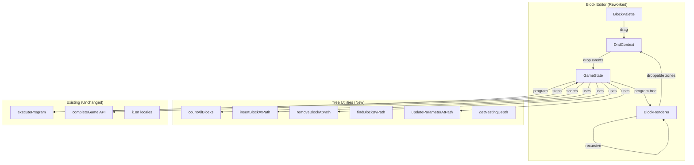

# Design Document: Space Coder Nesting Editor

## Overview

This feature transforms the Space Coder block editor from a flat list into a nested tree editor, enabling players to drag blocks inside REPEAT and IF container blocks. The execution engine (`executeProgram`) already interprets nested `block.body[]` and `block.elseBody[]` — the gap is entirely in the UI and tree-manipulation utilities.

### Key Design Decisions

1. **@dnd-kit/core with custom collision detection** — The project already uses `@dnd-kit/core@^6.3.1`. Rather than introducing a new DnD library, we extend the existing setup with nested droppable zones and custom collision detection to identify body/elseBody drop targets. `@dnd-kit/sortable` is installed but unused; we avoid it since container nesting requires custom drop zone logic rather than flat sortable lists.

2. **Immutable tree operations via path-based addressing** — Blocks in the tree are addressed by a `number[]` path (e.g., `[0, 2, 1]` means "top-level index 0 → body index 2 → body index 1"). All mutations (`insertBlockAtPath`, `removeBlockAtPath`, `updateParameterAtPath`) produce new arrays, keeping React state updates clean.

3. **Recursive React components** — A `<BlockRenderer>` component renders any block, and for container blocks it recursively renders children inside a C-shaped visual wrapper. Each body/elseBody slot is a `useDroppable` zone with a unique ID encoding its tree path.

4. **Scoring via existing `completeGame` API** — The backend `CompleteGameInput` already accepts `correctAnswers` and `totalQuestions`. We encode block efficiency by adjusting `correctAnswers` proportionally (e.g., 5 levels at 80% efficiency → `correctAnswers = 4`). No backend changes needed.

5. **Levels redesigned in-place** — The existing `MEDIUM_LEVELS` and `HARD_LEVELS` arrays in `scratchCodingUtils.ts` are replaced with new level definitions whose `maxBlocks` values force use of REPEAT and IF blocks for optimal solutions.

## Architecture



## Components and Interfaces

### 1. Tree Manipulation Utilities (`scratchCodingUtils.ts` additions)

```typescript
/** Path into the program tree. [] = top-level, [0] = first top-level block's body, etc. */
type BlockPath = number[];

/** Recursively count every block in a program tree. */
function countAllBlocks(blocks: Block[]): number;

/** Insert a block at the given path. Returns new tree or null if maxBlocks exceeded. */
function insertBlockAtPath(
  program: Block[],
  path: BlockPath,
  block: Block,
  maxBlocks: number
): Block[] | null;

/** Remove the block at the given path. Returns new tree. */
function removeBlockAtPath(program: Block[], path: BlockPath): Block[];

/** Update a parameter value for the block at the given path. Returns new tree. */
function updateParameterAtPath(
  program: Block[],
  path: BlockPath,
  value: number
): Block[];

/** Compute the nesting depth at a given path (path.length / 2, since each nesting adds container index + body index). */
function getNestingDepth(path: BlockPath): number;
```

### 2. BlockRenderer Component (New)

A recursive component that renders a single block. For container blocks (REPEAT, IF_WALL_AHEAD, IF_ON_GOAL), it renders the C-shaped wrapper with droppable body/elseBody zones.

```typescript
interface BlockRendererProps {
  block: Block;
  path: BlockPath;           // Position in the tree
  highlightedBlockId: string | null;
  disabled: boolean;
  onRemove: (path: BlockPath) => void;
  onParameterChange: (path: BlockPath, value: number) => void;
}
```

**Droppable zone IDs** encode the tree path as a string: `"body:{parentIndex},{bodyIndex}"` for body zones and `"else:{parentIndex},{bodyIndex}"` for elseBody zones. The `DragEndEvent` handler parses these IDs to determine where to insert.

### 3. ContainerBlockWrapper Component (New)

Renders the C-shape visual for REPEAT, IF_WALL_AHEAD, and IF_ON_GOAL blocks:

- **Top bar**: Block label + parameter input (for REPEAT) + remove button
- **Body section**: Droppable zone with vertically stacked child `<BlockRenderer>` instances
- **Else section** (IF_WALL_AHEAD only): Second droppable zone with "else" label
- **Bottom bar**: Closing bracket of the C-shape

Visual indentation increases with nesting depth via left margin/padding.

### 4. Reworked BlockEditor Component

The existing `BlockEditor` is refactored to:
- Use `countAllBlocks()` instead of `program.length` for the block count display
- Render blocks via `<BlockRenderer>` instead of inline `renderBlock()`
- Handle nested drop events by parsing droppable zone IDs
- Enforce max nesting depth of 3 on drop

### 5. Reworked DnD Handler

The `handleDragEnd` callback is updated to:
1. Parse the `over.id` string to determine if the drop target is the top-level editor or a nested body/elseBody zone
2. Compute the target `BlockPath` from the droppable ID
3. Check nesting depth ≤ 3 (reject with visual feedback if exceeded)
4. Call `insertBlockAtPath()` with the computed path
5. Check `countAllBlocks()` against `maxBlocks` before insertion

### 6. Updated Level Definitions

**Medium levels** (5 levels): `maxBlocks` set so flat solutions exceed the limit, forcing REPEAT usage. Corridors with repeating staircase/zigzag patterns on 7×7 grids.

**Hard levels** (5 levels): `maxBlocks` set so solutions without IF_WALL_AHEAD exceed the limit. Wall patterns on 8×8 grids requiring wall-checking and branching. At least 2 levels require both REPEAT and IF_WALL_AHEAD.

### 7. Execution Highlighting Updates

The existing `highlightedBlockId` mechanism already works by block ID. Since `executeProgram` emits `blockId` for each step and the recursive `BlockRenderer` checks `highlightedBlockId === block.id`, nested highlighting works automatically. The only addition is ensuring parent containers remain visually expanded (they always are in this design since there's no collapse mechanism).

## Data Models

### Block (Existing — Unchanged)

```typescript
interface Block {
  id: string;
  type: BlockType;
  parameter?: number;
  body?: Block[];       // Children for REPEAT, IF_WALL_AHEAD, IF_ON_GOAL
  elseBody?: Block[];   // Else branch for IF_WALL_AHEAD
}
```

### BlockPath (New)

```typescript
/** 
 * Describes a position in the program tree.
 * Even indices = block index in the current array
 * Odd indices = 0 for body, 1 for elseBody
 * 
 * Examples:
 *   [2]           → top-level block at index 2
 *   [0, 0, 1]    → block 0's body, child at index 1
 *   [1, 1, 0]    → block 1's elseBody, child at index 0
 *   [0, 0, 2, 0, 0] → block 0's body, child 2's body, child 0
 */
type BlockPath = number[];
```

### Droppable Zone ID Encoding

```
Top-level editor:  "block-editor"
Body zone:         "drop:body:[parentPath]:[insertIndex]"
ElseBody zone:     "drop:else:[parentPath]:[insertIndex]"

Examples:
  "drop:body:0:0"       → Insert into block 0's body at index 0
  "drop:else:1:2"       → Insert into block 1's elseBody at index 2
  "drop:body:0.0.1:0"   → Insert into block 0 → body[0] → body child 1's body at index 0
```

### Level (Existing — Updated Values Only)

The `Level` interface is unchanged. Only the constant level definitions (`MEDIUM_1` through `HARD_5`) get new grid layouts, `maxBlocks`, and `optimalBlocks` values.

### i18n Keys (New Additions)

```json
{
  "scratchCoding": {
    "nesting": {
      "ifLabel": "If",
      "elseLabel": "Else",
      "dropHere": "Drop blocks here",
      "maxDepthReached": "Maximum nesting depth reached!",
      "perfectEfficiency": "Perfect Efficiency ⚡",
      "goodEfficiency": "Good Efficiency 👍"
    }
  }
}
```

## Correctness Properties

*A property is a characteristic or behavior that should hold true across all valid executions of a system — essentially, a formal statement about what the system should do. Properties serve as the bridge between human-readable specifications and machine-verifiable correctness guarantees.*

### Property 1: Insert-remove round-trip

*For any* valid program tree and any valid insertion path, inserting a new block at that path and then removing the block at the same path SHALL return a program tree equivalent to the original.

**Validates: Requirements 9.4**

### Property 2: Insertion places block at correct path

*For any* valid program tree, any valid path (targeting a body or elseBody zone), and any new block, calling `insertBlockAtPath` SHALL produce a tree where the block at the given path has the same `id` and `type` as the inserted block.

**Validates: Requirements 2.2, 2.3, 9.2**

### Property 3: countAllBlocks recursive invariant

*For any* valid program tree, `countAllBlocks(tree)` SHALL equal the number of top-level blocks plus the sum of `countAllBlocks(block.body ?? [])` and `countAllBlocks(block.elseBody ?? [])` for each top-level block.

**Validates: Requirements 3.1, 3.5, 9.1, 9.5**

### Property 4: Count decreases by subtree size on removal

*For any* valid program tree and any valid path pointing to a block, `countAllBlocks(removeBlockAtPath(tree, path))` SHALL equal `countAllBlocks(tree)` minus the count of the removed subtree (1 for a flat block, or 1 + deep count of its body/elseBody for a container block).

**Validates: Requirements 3.4, 2.6, 2.7, 9.3**

### Property 5: Insertion rejected at max capacity

*For any* valid program tree where `countAllBlocks(tree)` equals `maxBlocks`, calling `insertBlockAtPath` with any new block and any valid path SHALL return `null`.

**Validates: Requirements 3.3**

### Property 6: updateParameterAtPath changes only the target block

*For any* valid program tree containing at least one parameterized block, and any valid path to a parameterized block, calling `updateParameterAtPath(tree, path, newValue)` SHALL produce a tree where only the block at that path has a changed parameter, and all other blocks remain identical.

**Validates: Requirements 4.3**

### Property 7: Block efficiency score computation

*For any* array of completed level results where each entry has `optimalBlocks > 0` and `actualBlocks >= optimalBlocks`, the Block_Efficiency_Score SHALL equal `min(1.0, sum(optimalBlocks) / sum(actualBlocks))`, and the result SHALL always be in the range `(0, 1.0]`.

**Validates: Requirements 7.1**

## Error Handling

### Tree Manipulation Errors

| Scenario | Handling |
|----------|----------|
| `insertBlockAtPath` with invalid path (out of bounds) | Return `null` — treat as rejected insertion |
| `insertBlockAtPath` when `countAllBlocks >= maxBlocks` | Return `null` — block limit reached |
| `insertBlockAtPath` when nesting depth > 3 | Return `null` — max depth exceeded |
| `removeBlockAtPath` with invalid path | Return original tree unchanged |
| `updateParameterAtPath` with invalid path | Return original tree unchanged |
| `countAllBlocks` on empty array | Return `0` |

### DnD Interaction Errors

| Scenario | Handling |
|----------|----------|
| Drop on invalid zone (not a recognized droppable ID) | Ignore the drop event silently |
| Drop container block that would exceed depth 3 | Show localized "max depth reached" toast for 2 seconds, reject drop |
| Drop when block count at max | Show existing "Maximum blocks reached!" indicator, reject drop |

### Execution Errors

No changes to execution error handling — the existing `executeProgram` already handles nested blocks, wall collisions, and out-of-bounds correctly.

### API Errors

No changes — the existing `completeGame` error handling (rate limit redirect, silent failure) remains unchanged. The efficiency score is passed as part of the existing `correctAnswers` field.

## Testing Strategy

### Property-Based Tests (Vitest + fast-check)

The project uses Vitest. We use `fast-check` for property-based testing of the pure tree manipulation utilities.

**Configuration**: Minimum 100 iterations per property test.

**Tag format**: `Feature: space-coder-nesting-editor, Property {number}: {property_text}`

| Property | Function Under Test | Generator Strategy |
|----------|--------------------|--------------------|
| 1: Insert-remove round-trip | `insertBlockAtPath` + `removeBlockAtPath` | Generate random program trees (depth 0-3, width 0-4) and valid paths |
| 2: Insertion at correct path | `insertBlockAtPath` | Generate random trees and valid body/elseBody paths |
| 3: countAllBlocks recursive invariant | `countAllBlocks` | Generate random program trees of varying depth and width |
| 4: Count decreases on removal | `countAllBlocks` + `removeBlockAtPath` | Generate random trees with at least one block, pick random valid path |
| 5: Insertion rejected at max | `insertBlockAtPath` | Generate trees where count equals a chosen maxBlocks value |
| 6: Parameter update isolation | `updateParameterAtPath` | Generate trees with parameterized blocks, pick random path to one |
| 7: Efficiency score formula | `computeBlockEfficiency` | Generate arrays of (optimal, actual) pairs with actual >= optimal > 0 |

**Generator for random program trees**: Recursively generate `Block[]` arrays where each block is either a flat block (MOVE_FORWARD, TURN_LEFT, TURN_RIGHT) or a container block (REPEAT, IF_WALL_AHEAD, IF_ON_GOAL) with recursively generated `body[]` and `elseBody[]`, respecting a max depth parameter.

### Unit Tests (Vitest)

- **C-shape rendering**: Verify DOM structure for REPEAT, IF_WALL_AHEAD, IF_ON_GOAL containers (empty and with children)
- **Parameter editing**: Verify input renders with correct min/max/default at any nesting depth
- **Event propagation**: Verify clicking parameter input doesn't trigger block removal
- **Efficiency indicators**: Verify "Perfect Efficiency" and "Good Efficiency" labels appear at correct thresholds
- **Level definitions**: Verify medium levels are 7×7 with REPEAT available, hard levels are 8×8 with IF_WALL_AHEAD available

### Integration Tests

- **DnD flow**: Simulate drag from palette → drop into body zone → verify tree update
- **Nested DnD**: Simulate drag into a nested container → verify correct path resolution
- **Touch support**: Verify TouchSensor is configured alongside PointerSensor
- **i18n**: Verify all new keys exist in en.json, es.json, pt.json

### Manual Testing

- Visual verification of C-shape rendering at various nesting depths
- Touch device testing for drag-and-drop interactions
- Level playtesting to verify optimal solutions require REPEAT/IF blocks

