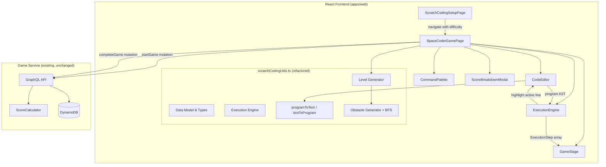

# Design Document: Space Coder Terminal Rework

## Overview

This feature completely replaces the Space Coder game's Scratch-style block editor with a retro terminal-style text coding interface. Instead of dragging colored pills, players click command buttons from a palette to insert text lines into a green-on-black monospace code editor. The new command set includes `forward()`, `turn-left()`, `turn-right()`, `jump()`, `loop(n)...next`, `if(obstacle-ahead)...else...end-if`, and `while(not-at-goal)...end-while`.

Key changes from the existing implementation:
- **Editor**: Colored drag-and-drop block pills → retro terminal text editor (green monospace on black, line numbers, blinking cursor)
- **Commands**: `MOVE_FORWARD(n)` with parameter → `forward()` always 1 step; new `jump()` command; new `while(not-at-goal)` loop
- **Grid sizes**: 6×6 / 7×7 / 8×8 → 6×6 / 8×8 / 12×12
- **Hard levels**: Hand-crafted 8×8 → randomly generated 12×12 with BFS-validated obstacle placement
- **Scoring**: Block count efficiency → line count efficiency
- **Removed**: All `@dnd-kit` imports, `BlockRenderer.tsx`, `ContainerBlockWrapper`, `BlockPath`-based tree manipulation, `ON_START` block type

The game retains the existing routes (`/scratch-coding/setup`, `/scratch-coding/game`), `themeId: "SCRATCH_CODING"`, difficulty selection page, execution animation, `completeGame` API integration, leaderboard integration, `ScoreBreakdownModal`, and i18n support (EN, ES, PT). No backend changes are required.

## Architecture



The architecture remains a two-layer split:

1. **Frontend (modified code)**: All game logic lives in `apps/web/src/pages/scratch-coding/` and `apps/web/src/utils/scratchCodingUtils.ts`. The page component is refactored in-place (same file, new internals). `BlockRenderer.tsx` is deleted. Two new inline components replace the old ones: `CommandPalette` (clickable buttons) and `CodeEditor` (terminal-style text display).

2. **Backend (no changes)**: The game continues to use `startGame` and `completeGame` mutations with `themeId: "SCRATCH_CODING"`. The `CompleteGameInput` interface already supports `correctAnswers` and `totalQuestions`, which map to efficiency-weighted levels completed and total levels.

### Key Architectural Decisions

| Decision | Rationale |
|---|---|
| Refactor `scratchCodingUtils.ts` in-place | Keeps the single-file utility pattern consistent with other DashDen games. The module is already ~1000 lines; the rework replaces types and functions rather than adding to them. |
| Inline `CommandPalette` and `CodeEditor` in the game page | Matches the existing pattern where `BlockPalette` and `BlockEditor` are defined in `ScratchCodingGamePage.tsx`. Keeps all game UI in one file. |
| Delete `BlockRenderer.tsx` entirely | No component from this file is reused. The terminal editor renders text lines, not block pills. |
| Keep program as a tree (not flat text) | The execution engine needs tree structure for nested control flow. Text rendering is a view concern handled by `programToText`. |
| Random obstacle generation with BFS validation | Hard levels need replayability. BFS guarantees solvability. Obstacle removal fallback ensures generation always succeeds. |
| `forward()` always 1 step (no parameter) | Forces loop usage for efficiency, which is the core learning objective for medium/hard levels. |

## Components and Interfaces

### Page Components

#### ScratchCodingSetupPage (modified)
- **Path**: `apps/web/src/pages/scratch-coding/ScratchCodingSetupPage.tsx`
- **Changes**: Update difficulty descriptions to reflect new grid sizes (6×6, 8×8, 12×12) and new command sets. Update "How to Play" text to describe terminal-style coding instead of drag-and-drop.
- **No structural changes**: Same route, same navigation, same difficulty selection pattern.

#### SpaceCoderGamePage (major refactor)
- **Path**: `apps/web/src/pages/scratch-coding/ScratchCodingGamePage.tsx`
- **Responsibility**: Orchestrates the game — manages game state, level progression, timer, API calls
- **Removed**: All `@dnd-kit` imports (`DndContext`, `useDraggable`, `useDroppable`, `PointerSensor`, `TouchSensor`, `useSensors`), `DragEndEvent` handler, `BlockRenderer` import, `BlockPath` usage
- **State changes**:
  - `program: Command[]` (was `Block[]`) — flat top-level array of command tree nodes
  - `insertionCursor: InsertionCursor` — tracks where next command inserts (new)
  - Phase type unchanged: `'building' | 'running' | 'success' | 'fail' | 'submitting' | 'completed'`
- **Lifecycle**: Same as before (startGame on mount → play → completeGame on finish)

### Game Sub-Components (all inline in game page)

#### CommandPalette
- **Responsibility**: Displays clickable command buttons filtered by difficulty
- **Interface**:
  ```typescript
  interface CommandPaletteProps {
    difficulty: Difficulty
    disabled: boolean
    maxReached: boolean
    onCommandInsert: (type: CommandType) => void
  }
  ```
- **Behavior**:
  - Easy: `forward()`, `turn-left()`, `turn-right()`
  - Medium: adds `loop(n)...next`
  - Hard: adds `jump()`, `if(obstacle-ahead)...end-if`, `while(not-at-goal)...end-while`
  - Buttons disabled during execution or when max lines reached
  - Styled as retro terminal buttons (dark background, green/amber text, monospace font)

#### CodeEditor
- **Responsibility**: Renders the program as green monospace text on black background with line numbers, insertion cursor, and active-line highlighting
- **Interface**:
  ```typescript
  interface CodeEditorProps {
    program: Command[]
    maxLines: number
    highlightedLineIndex: number | null  // active line during execution
    insertionCursor: InsertionCursor
    disabled: boolean
    onLineClick: (lineIndex: number) => void  // remove line or select insertion point
    onLoopParameterChange: (commandId: string, value: number) => void
    onClearAll: () => void
  }
  ```
- **Behavior**:
  - Renders `programToText(program)` as numbered lines
  - Black background (#000), green (#00FF00) monospace font
  - Blinking cursor indicator at insertion point
  - Click a command line → remove it (or remove entire control structure if it's an opening/closing line)
  - Highlighted line during execution (bright yellow/cyan background)
  - Vertical scroll when program exceeds visible area
  - Loop parameter shown as inline editable number input on `loop(n)` lines

#### GameStage (modified)
- **Responsibility**: Renders the grid, character, goal, obstacles; animates character movement
- **Interface**: Same as before plus obstacle cell rendering
  ```typescript
  interface GameStageProps {
    level: Level
    characterPos: Position
    characterDir: Direction
    isAnimating: boolean
  }
  ```
- **Changes**:
  - Support 12×12 grid with proportional cell scaling
  - Render `obstacle` cells as rocks (🪨) distinct from walls
  - Jump animation: show mid-jump position above obstacle

### Utility Module

#### scratchCodingUtils.ts (major refactor)
- **Path**: `apps/web/src/utils/scratchCodingUtils.ts`
- **Removed exports**: `BlockType`, `Block`, `BlockDefinition`, `BlockCategory`, `BlockPath`, `BLOCK_DEFINITIONS`, `createBlock`, `insertBlock`, `removeBlock`, `insertBlockAtPath`, `removeBlockAtPath`, `updateParameterAtPath`, `countAllBlocks`, `getNestingDepth`, all hand-crafted hard levels
- **New/modified exports**:
  - `CommandType`, `Command`, `CommandDefinition` — new type system
  - `programToText(program: Command[]): string[]` — renders program as indented text lines
  - `textToProgram(lines: string[]): Command[]` — parses text lines back to command tree
  - `countAllLines(commands: Command[]): number` — recursive line counter
  - `insertCommand(program, type, cursor): { program, cursor }` — context-aware insertion
  - `removeAtLine(program, lineIndex): { program, cursor }` — line-based removal
  - `generateObstacles(grid, start, goal, targetCount): Grid` — random obstacle placement with BFS validation
  - `bfsPathExists(grid, start, goal): boolean` — BFS pathfinding
  - `executeProgram(level, program): ExecutionStep[]` — updated engine with `FORWARD`, `JUMP`, `WHILE_NOT_GOAL`
  - `computeLineEfficiency(results): number` — line-based efficiency scoring

## Data Models

### Command Types (replaces Block Types)

```typescript
type CommandType =
  | 'FORWARD'           // forward() — always 1 step
  | 'TURN_LEFT'         // turn-left()
  | 'TURN_RIGHT'        // turn-right()
  | 'JUMP'              // jump() — hop over obstacle
  | 'LOOP'              // loop(n)...next
  | 'IF_OBSTACLE'       // if(obstacle-ahead)...else...end-if
  | 'WHILE_NOT_GOAL'    // while(not-at-goal)...end-while

interface Command {
  id: string              // unique ID for tracking
  type: CommandType
  parameter?: number      // only for LOOP (repeat count, default 2, min 1, max 20)
  body?: Command[]        // for LOOP, IF_OBSTACLE (then branch), WHILE_NOT_GOAL
  elseBody?: Command[]    // for IF_OBSTACLE only (else branch)
}

interface CommandDefinition {
  type: CommandType
  label: string           // i18n key for button text
  textRepresentation: string  // e.g., 'forward()', 'turn-left()'
  isControlStructure: boolean
  hasParameter: boolean
  parameterDefault: number
  parameterMin: number
  parameterMax: number
  hasBody: boolean
  hasElseBody: boolean
  minDifficulty: Difficulty
}
```

### Command Definitions

```typescript
const COMMAND_DEFINITIONS: CommandDefinition[] = [
  {
    type: 'FORWARD', label: 'spaceCoder.commands.forward',
    textRepresentation: 'forward()',
    isControlStructure: false, hasParameter: false,
    parameterDefault: 0, parameterMin: 0, parameterMax: 0,
    hasBody: false, hasElseBody: false, minDifficulty: 'easy',
  },
  {
    type: 'TURN_LEFT', label: 'spaceCoder.commands.turnLeft',
    textRepresentation: 'turn-left()',
    isControlStructure: false, hasParameter: false,
    parameterDefault: 0, parameterMin: 0, parameterMax: 0,
    hasBody: false, hasElseBody: false, minDifficulty: 'easy',
  },
  {
    type: 'TURN_RIGHT', label: 'spaceCoder.commands.turnRight',
    textRepresentation: 'turn-right()',
    isControlStructure: false, hasParameter: false,
    parameterDefault: 0, parameterMin: 0, parameterMax: 0,
    hasBody: false, hasElseBody: false, minDifficulty: 'easy',
  },
  {
    type: 'JUMP', label: 'spaceCoder.commands.jump',
    textRepresentation: 'jump()',
    isControlStructure: false, hasParameter: false,
    parameterDefault: 0, parameterMin: 0, parameterMax: 0,
    hasBody: false, hasElseBody: false, minDifficulty: 'hard',
  },
  {
    type: 'LOOP', label: 'spaceCoder.commands.loop',
    textRepresentation: 'loop(n)',
    isControlStructure: true, hasParameter: true,
    parameterDefault: 2, parameterMin: 1, parameterMax: 20,
    hasBody: true, hasElseBody: false, minDifficulty: 'medium',
  },
  {
    type: 'IF_OBSTACLE', label: 'spaceCoder.commands.ifObstacle',
    textRepresentation: 'if(obstacle-ahead)',
    isControlStructure: true, hasParameter: false,
    parameterDefault: 0, parameterMin: 0, parameterMax: 0,
    hasBody: true, hasElseBody: true, minDifficulty: 'hard',
  },
  {
    type: 'WHILE_NOT_GOAL', label: 'spaceCoder.commands.whileNotGoal',
    textRepresentation: 'while(not-at-goal)',
    isControlStructure: true, hasParameter: false,
    parameterDefault: 0, parameterMin: 0, parameterMax: 0,
    hasBody: true, hasElseBody: false, minDifficulty: 'hard',
  },
]
```

### Insertion Cursor Model

```typescript
interface InsertionCursor {
  /** The command ID of the parent control structure, or null for top-level */
  parentId: string | null
  /** 'body' or 'elseBody' — which branch of the parent to insert into */
  branch: 'body' | 'elseBody'
  /** Index within the target array where the next command will be inserted */
  index: number
}
```

The insertion cursor determines where the next command is placed:
- After inserting a control structure (`loop`, `if`, `while`), the cursor moves inside its body at index 0
- After inserting a simple command, the cursor advances by 1 within the current context
- Clicking a line moves the cursor to after that line's position
- The cursor is visually shown as a blinking green line between code lines

### Cell Type (updated)

```typescript
type CellType = 'empty' | 'wall' | 'goal' | 'obstacle'
```

The `obstacle` cell type is new. Walls block all movement. Obstacles block `forward()` but can be jumped over with `jump()`.

### Level Data Structure (updated)

```typescript
interface Level {
  grid: CellType[][]
  rows: number
  cols: number
  start: Position
  startDir: Direction
  goal: Position
  maxLines: number         // was maxBlocks — max command lines allowed
  optimalLines: number     // was optimalBlocks — fewest lines for optimal solution
  levelNumber: number
  hint?: string
  availableCommands: CommandType[]
  generateObstacles?: boolean  // true for hard levels — regenerate on each load
  obstacleCount?: number       // target obstacle count for generation (8-20)
}
```

### Difficulty Configuration (updated)

```typescript
const DIFFICULTY_CONFIG: Record<Difficulty, DifficultyConfig> = {
  easy: {
    label: 'Easy', emoji: '🟢',
    description: '6×6 grid · forward, turn',
    levelCount: 5, gridSize: 6,
    availableCommands: ['FORWARD', 'TURN_LEFT', 'TURN_RIGHT'],
  },
  medium: {
    label: 'Medium', emoji: '🟡',
    description: '8×8 grid · loops!',
    levelCount: 5, gridSize: 8,
    availableCommands: ['FORWARD', 'TURN_LEFT', 'TURN_RIGHT', 'LOOP'],
  },
  hard: {
    label: 'Hard', emoji: '🔴',
    description: '12×12 grid · obstacles & conditionals',
    levelCount: 5, gridSize: 12,
    availableCommands: ['FORWARD', 'TURN_LEFT', 'TURN_RIGHT', 'JUMP', 'LOOP', 'IF_OBSTACLE', 'WHILE_NOT_GOAL'],
  },
}
```

### Execution Engine Types (updated)

```typescript
interface ExecutionStep {
  commandId: string       // was blockId — which command produced this step
  lineIndex: number       // line number in the text rendering (for highlighting)
  pos: Position
  dir: Direction
  alive: boolean
  reachedGoal: boolean
  hitWall: boolean
  hitObstacle: boolean    // new — hit an obstacle without jumping
  outOfBounds: boolean
  isJumpMidpoint: boolean // new — true for the mid-air frame of a jump
  errorType?: 'collision' | 'no-obstacle-to-jump' | 'infinite-loop' | 'jump-landing-blocked'
}
```

### Program-to-Text Rendering

The `programToText` function converts the command tree to display lines:

```
forward()
turn-right()
loop(3)
  forward()
  if(obstacle-ahead)
    jump()
  else
    forward()
  end-if
next
turn-left()
while(not-at-goal)
  forward()
end-while
```

Rules:
- Simple commands render as their text representation on one line
- `LOOP` renders as `loop(n)` + body lines (indented +2 spaces) + `next`
- `IF_OBSTACLE` renders as `if(obstacle-ahead)` + then body (indented) + `else` + else body (indented) + `end-if`
- `WHILE_NOT_GOAL` renders as `while(not-at-goal)` + body (indented) + `end-while`
- Nesting increases indentation by 2 spaces per level

### Text-to-Program Parsing

The `textToProgram` function parses indented text lines back into a command tree. This is the inverse of `programToText` and is used for the round-trip correctness property. The parser uses a stack-based approach:

1. Iterate through lines, tracking indentation level
2. Simple commands (`forward()`, `turn-left()`, etc.) create leaf `Command` nodes
3. `loop(n)` pushes a new LOOP command onto the stack; subsequent indented lines go into its body until `next`
4. `if(obstacle-ahead)` pushes an IF_OBSTACLE command; `else` switches to elseBody; `end-if` pops
5. `while(not-at-goal)` pushes a WHILE_NOT_GOAL command; `end-while` pops

### Obstacle Generation Algorithm

```typescript
function generateObstacles(
  rows: number,
  cols: number,
  start: Position,
  goal: Position,
  targetCount: number,
): CellType[][] {
  // 1. Create empty grid
  // 2. Collect candidate cells (exclude start, goal, and cells adjacent to start)
  // 3. Shuffle candidates
  // 4. Place obstacles one at a time up to targetCount
  // 5. After each placement, run BFS to verify path exists
  // 6. If BFS fails, remove the last obstacle
  // 7. Continue until targetCount placed or candidates exhausted
  // 8. Return final grid
}

function bfsPathExists(
  grid: CellType[][],
  start: Position,
  goal: Position,
): boolean {
  // Standard BFS on 4-connected grid
  // Treats 'wall' and 'obstacle' as impassable for pathfinding
  // (The player can jump obstacles, but BFS validates basic reachability)
  // Returns true if goal is reachable from start
}
```

The BFS treats obstacles as impassable for validation purposes. This is conservative — it ensures a path exists even without `jump()`. Since `jump()` provides additional movement options, any grid that passes BFS validation is guaranteed solvable.

### Execution Engine Changes

The execution engine is updated to handle the new command types:

| Command | Behavior |
|---|---|
| `FORWARD` | Move 1 cell in current direction. Collision if wall, obstacle, or OOB. |
| `TURN_LEFT` | Rotate 90° counter-clockwise. |
| `TURN_RIGHT` | Rotate 90° clockwise. |
| `JUMP` | If obstacle ahead: move 2 cells (skip obstacle). Error if no obstacle ahead. Error if landing cell is blocked/OOB. Produces 2 steps (midpoint + landing). |
| `LOOP` | Execute body N times. Nesting up to depth 3. |
| `IF_OBSTACLE` | Check cell ahead for obstacle/wall. Execute then-branch if true, else-branch if false. |
| `WHILE_NOT_GOAL` | Repeat body until astronaut is on goal cell. Max 500 steps safeguard. |

The `lineIndex` field in `ExecutionStep` maps each step to the corresponding line in the text rendering, enabling the CodeEditor to highlight the active line during animation.

### Line Count Calculation

`countAllLines` recursively counts all lines a program would render:
- Simple command: 1 line
- `LOOP`: 1 (loop line) + body lines + 1 (next line)
- `IF_OBSTACLE`: 1 (if line) + then body lines + 1 (else line) + else body lines + 1 (end-if line)
- `WHILE_NOT_GOAL`: 1 (while line) + body lines + 1 (end-while line)

### Scoring Integration

The scoring formula mirrors the existing approach but uses line counts:

```typescript
function computeLineEfficiency(
  results: Array<{ optimalLines: number; actualLines: number }>
): number {
  const sumOptimal = results.reduce((s, r) => s + r.optimalLines, 0)
  const sumActual = results.reduce((s, r) => s + r.actualLines, 0)
  if (sumActual === 0) return 1.0
  return Math.min(1.0, sumOptimal / sumActual)
}
```

The `completeGame` call passes `correctAnswers = Math.round(levelsCompleted * efficiency)` and `totalQuestions = totalLevels`, matching the existing pattern.

## Correctness Properties

*A property is a characteristic or behavior that should hold true across all valid executions of a system — essentially, a formal statement about what the system should do. Properties serve as the bridge between human-readable specifications and machine-verifiable correctness guarantees.*

### Property 1: Program text round-trip

*For any* valid program tree (composed of any combination of FORWARD, TURN_LEFT, TURN_RIGHT, JUMP, LOOP, IF_OBSTACLE, and WHILE_NOT_GOAL commands with arbitrary nesting up to depth 3), converting to text via `programToText` and parsing back via `textToProgram` shall produce an equivalent program tree.

**Validates: Requirements 18.5, 1.2, 1.3**

### Property 2: Command visibility is determined by difficulty threshold

*For any* command definition and *for any* difficulty level, the command should be available in the palette if and only if the command's `minDifficulty` rank is less than or equal to the current difficulty rank (easy=1 ≤ medium=2 ≤ hard=3).

**Validates: Requirements 2.2, 2.3, 2.4**

### Property 3: Command insertion produces correct line count and cursor position

*For any* valid program and *for any* command type, inserting a command via `insertCommand` shall: (a) increase `countAllLines` by exactly 1 for simple commands, by 2 for LOOP and WHILE_NOT_GOAL (opening + closing line), and by 3 for IF_OBSTACLE (if + else + end-if); and (b) position the insertion cursor inside the body of a newly inserted control structure, or advance by 1 for simple commands.

**Validates: Requirements 2.5, 2.6, 2.7, 2.8, 4.2, 4.4, 4.5**

### Property 4: Control structure removal removes entire structure

*For any* program containing at least one control structure, removing at the line index of the structure's opening line or closing line shall remove the entire structure (opening, body, closing, and else branch if applicable), and the resulting program's `countAllLines` shall decrease by the total line count of that structure.

**Validates: Requirements 3.2, 3.7**

### Property 5: Forward collision detection

*For any* level grid and *for any* astronaut position and direction where the cell directly ahead is a wall, obstacle, or out of bounds, executing a FORWARD command shall produce an ExecutionStep with `alive=false` and the appropriate error flag (`hitWall`, `hitObstacle`, or `outOfBounds`).

**Validates: Requirements 6.1, 6.3, 6.4**

### Property 6: Jump command correctness

*For any* level grid and astronaut position/direction: (a) if an obstacle is directly ahead and the landing cell (2 ahead) is empty or goal, `jump()` shall produce exactly 2 ExecutionSteps moving the astronaut to the landing cell; (b) if no obstacle is directly ahead, `jump()` shall produce an error step; (c) if the landing cell is blocked or out of bounds, `jump()` shall produce an error step.

**Validates: Requirements 7.1, 7.2, 7.3, 7.4**

### Property 7: If-structure branches correctly based on obstacle-ahead condition

*For any* level grid, astronaut position/direction, and if(obstacle-ahead) structure with non-empty then and else branches: when an obstacle or wall is in the cell directly ahead, the execution engine shall execute the then-branch commands; when the cell ahead is empty, the engine shall execute the else-branch commands.

**Validates: Requirements 9.1, 9.2, 9.3**

### Property 8: While loop terminates when goal is reached

*For any* level where the astronaut can reach the goal by executing the while body, the while(not-at-goal) structure shall exit after the astronaut's position equals the goal position, and the final ExecutionStep shall have `reachedGoal=true`.

**Validates: Requirements 10.1, 10.2, 10.3**

### Property 9: Execution step limit safeguard

*For any* program that would produce more than 500 execution steps (e.g., loop with large N, or while loop that doesn't reach goal), the execution engine shall stop at or before 500 steps and the final step shall indicate an infinite-loop error.

**Validates: Requirements 8.4, 10.4**

### Property 10: Obstacle generator solvability and bounds

*For any* valid inputs to the obstacle generator (12×12 grid, valid start and goal positions, target obstacle count between 8 and 20), the output grid shall satisfy: (a) a valid BFS path exists from start to goal (solvability invariant); (b) no obstacles are placed on the start cell, goal cell, or cells adjacent to start; (c) the obstacle count is between 1 and the target count (inclusive).

**Validates: Requirements 13.2, 13.7, 21.2, 21.3, 21.6, 21.7**

### Property 11: Line efficiency calculation

*For any* array of level results where each result has optimalLines > 0 and actualLines > 0, `computeLineEfficiency` shall return `min(1.0, sum(optimalLines) / sum(actualLines))`. When actualLines sum is 0, it shall return 1.0.

**Validates: Requirements 15.1**

### Property 12: countAllLines invariant

*For any* valid program tree, `countAllLines(program)` shall return a value greater than or equal to `program.length` (the number of top-level commands), because control structures contribute additional structural lines (closing keywords, else lines).

**Validates: Requirements 18.3, 18.6**

## Error Handling

| Scenario | Handling |
|---|---|
| `startGame` rate limit error | Redirect to `/rate-limit` page (matches existing pattern) |
| `startGame` network/other error | Show error toast, stay on setup page |
| `completeGame` failure | Show ScoreBreakdownModal without score data, allow navigation to hub |
| Forward into wall | Execution stops, `alive=false`, `hitWall=true`, show failure overlay: "Astronaut hit an asteroid! ☄️" |
| Forward into obstacle | Execution stops, `alive=false`, `hitObstacle=true`, show failure overlay: "Astronaut hit a rock! Use jump() to hop over obstacles 🪨" |
| Forward out of bounds | Execution stops, `alive=false`, `outOfBounds=true`, show failure overlay: "Astronaut drifted into space! ☄️" |
| Jump with no obstacle ahead | Execution stops, `errorType='no-obstacle-to-jump'`, show: "Nothing to jump over! jump() needs an obstacle ahead 🤔" |
| Jump landing blocked | Execution stops, `errorType='jump-landing-blocked'`, show: "Can't land there! The landing spot is blocked ☄️" |
| Step limit exceeded (500) | Execution stops, `errorType='infinite-loop'`, show: "Program ran too long! Check your loops 🔄" |
| Max lines reached | Command palette buttons disabled, yellow indicator: "Maximum lines reached!" |
| Empty program run attempt | Run button disabled when program is empty |
| Obstacle generation fails to place any obstacles | Generator returns grid with 0 obstacles (degenerate case); level is still solvable |
| Loop parameter out of range | Clamp to [1, 20] on input change |

## Testing Strategy

### Dual Testing Approach

The testing strategy uses both unit tests (specific examples and edge cases) and property-based tests (universal properties across generated inputs). Property-based tests use `fast-check` (already a devDependency in `apps/web/package.json` at `^4.6.0`) with Vitest (available at `^4.1.4`).

### Property-Based Tests

Each property test runs a minimum of **100 iterations** with randomly generated inputs. Tests are tagged with comments referencing the design property.

**Tag format**: `// Feature: space-coder-terminal-rework, Property N: <property text>`

Properties to implement as PBT:

| Property | Test Description | Generator Strategy |
|---|---|---|
| 1: Round-trip | Generate random program trees, verify `textToProgram(programToText(p))` ≡ `p` | Recursive tree generator: random command types, random nesting (depth ≤ 3), random loop params |
| 2: Difficulty threshold | Generate (commandDef, difficulty) pairs, verify visibility | Enumerate all command defs × all difficulties |
| 3: Insertion correctness | Generate programs + command types, verify line count delta and cursor | Random programs + random command types |
| 4: Structure removal | Generate programs with control structures, remove at structure line | Random programs with ≥1 control structure |
| 5: Forward collision | Generate grids with walls/obstacles, positions facing them | Random grid positions + directions facing blocked cells |
| 6: Jump correctness | Generate grids with obstacles, test all 3 jump scenarios | Random positions with obstacle ahead (valid/invalid landing) |
| 7: If branching | Generate positions with/without obstacles, verify branch taken | Random positions + if structures with distinct branches |
| 8: While termination | Generate simple while programs that reach goal | Small grids with short paths + while(not-at-goal) { forward() } |
| 9: Step limit | Generate programs with large loops | Random loop(N) with N > 50 and body that doesn't reach goal |
| 10: Obstacle generator | Generate random start/goal/targetCount, verify invariants | Random 12×12 positions + target counts [8, 20] |
| 11: Efficiency calculation | Generate arrays of {optimalLines, actualLines} | Random positive integers for optimal and actual |
| 12: countAllLines invariant | Generate random programs, verify ≥ top-level count | Same generator as Property 1 |

### Unit Tests (Example-Based)

Focus on specific scenarios, edge cases, and UI behavior:

**Utility functions**:
- `programToText` with specific known programs (empty, single command, nested 3 levels)
- `textToProgram` with specific text inputs
- `countAllLines` with known programs
- `insertCommand` edge cases: insert at max lines (rejected), insert into empty program
- `removeAtLine` edge cases: remove from empty program, remove last line
- `generateObstacles` with minimal grid, maximum obstacles
- `bfsPathExists` with known solvable and unsolvable grids
- `executeProgram` with specific level/program combos (easy level solutions, jump scenarios)

**Component rendering**:
- CommandPalette renders correct buttons per difficulty
- CodeEditor renders line numbers, green-on-black styling, blinking cursor
- GameStage renders correct grid size per difficulty, obstacle cells as rocks
- SetupPage updated descriptions

**Game flow**:
- Level completion overlay shows line count vs optimal
- "Perfect Code" / "Clean Code" indicators
- Retry resets program and cursor
- Timer tracks elapsed time
- completeGame called with correct parameters

**Removal of old code**:
- No `@dnd-kit` imports in any scratch-coding files
- No `BlockRenderer` or `ContainerBlockWrapper` references
- No `BlockPath`, `insertBlockAtPath`, `removeBlockAtPath` references
- No old block types (`MOVE_FORWARD`, `REPEAT`, `IF_WALL_AHEAD`, `IF_ON_GOAL`, `ON_START`)

**i18n**:
- All `spaceCoder.*` keys present in en, es, pt locale files
- Command text in CodeEditor remains English regardless of locale

### Integration Tests

- `startGame` mutation called with `themeId: "SCRATCH_CODING"` and correct difficulty mapping
- `completeGame` mutation called with `gameId`, `completionTime`, `attempts`, `correctAnswers` (efficiency-weighted), `totalQuestions`
- ScoreBreakdownModal receives and displays score data
- Navigation: Setup → Game → Hub

