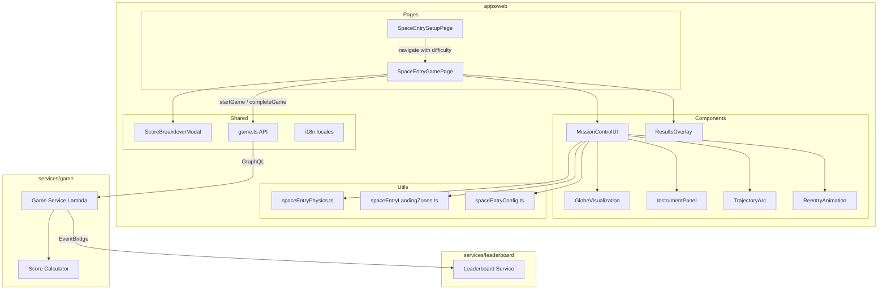

# Design Document — Space Entry Game

## Overview

Space Entry is an atmospheric reentry simulation game for DashDen where players calculate entry angles to land a spacecraft safely on Earth. Each mission assigns a random real-world target location from 20+ landing zones spanning all continents. The player adjusts the angle of inclination, manages heat shield integrity, and accounts for atmospheric density to achieve a safe landing. Three outcomes are possible: Successful Landing, Orbital Burn-up, or Skip-off.

The game follows the established DashDen game architecture: a Setup Page for difficulty selection, a Game Page with a "Mission Control" UI, backend integration via `startGame`/`completeGame` GraphQL mutations, the shared `ScoreBreakdownModal`, leaderboard integration, and full i18n support (en/es/pt).

The core physics engine is implemented as a set of pure functions in a dedicated utility module, enabling deterministic behavior and property-based testing. The globe visualization uses a lightweight CSS/SVG approach (circular gradient with continent outlines) rather than a heavy WebGL library, keeping load times fast for the target audience (kids).

## Architecture

### Component Diagram



### Data Flow

1. **Setup**: Player selects difficulty on `SpaceEntrySetupPage` → navigates to `/space-entry/game?difficulty=easy|medium|hard`
2. **Init**: `SpaceEntryGamePage` calls `startGame({ themeId: 'SPACE_ENTRY', difficulty })` → stores `gameId`
3. **Target Assignment**: Random `LandingZone` selected from `spaceEntryLandingZones.ts` → displayed on globe
4. **Player Input**: Player adjusts `entryAngle` via slider/input → trajectory preview updates in real time
5. **Reentry**: Player clicks "Initiate Reentry" → `calculateTrajectory()` computes outcome → `calculateHeatShieldDegradation()` computes shield loss
6. **Animation**: CSS-based reentry animation plays (3–6 seconds) showing descent, burn-up, or skip-off
7. **Results**: Outcome overlay displayed with geography fact (success) or failure message
8. **Score**: On success, player clicks "See Score" → `completeGame()` called → `ScoreBreakdownModal` shown

## Components and Interfaces

### Pages

#### SpaceEntrySetupPage (`apps/web/src/pages/space-entry/SpaceEntrySetupPage.tsx`)

Follows the established DashDen setup page pattern (see `MathSetupPage`, `HistoryQuizSetupPage`).

- Displays three difficulty cards: Easy 🟢, Medium 🟡, Hard 🔴
- Each card shows difficulty name, emoji, and description text
- Start button disabled until a difficulty is selected
- On start: navigates to `ROUTES.SPACE_ENTRY_GAME + '?difficulty=' + selectedDifficulty`
- Space-themed gradient background (`from-indigo-900 via-purple-900 to-black`)
- All text via `useTranslation()` with `spaceEntry.*` keys

#### SpaceEntryGamePage (`apps/web/src/pages/space-entry/SpaceEntryGamePage.tsx`)

Main game page managing the full game lifecycle.

**State:**
- `gameId: string` — from `startGame` response
- `difficulty: 'easy' | 'medium' | 'hard'` — from URL search params
- `targetZone: LandingZone` — randomly selected landing zone
- `entryAngle: number` — player's current angle input (0–90)
- `heatShieldIntegrity: number` — current shield percentage
- `phase: 'setup' | 'reentry' | 'results' | 'submitting' | 'completed'` — game phase
- `outcome: ReentryOutcome | null` — computed outcome after reentry
- `elapsedTime: number` — running timer in seconds
- `attempts: number` — retry counter within session
- `scoreBreakdown / leaderboardRank` — from `completeGame` response

**Lifecycle:**
1. On mount: call `startGame`, select random `LandingZone`, start timer
2. During `setup` phase: render `MissionControlUI` with input controls
3. On "Initiate Reentry": compute trajectory + heat shield → set phase to `reentry`
4. After animation completes: set phase to `results`, show `ResultsOverlay`
5. On "See Score": call `completeGame`, show `ScoreBreakdownModal`
6. On "Try Again": reset to `setup` phase, same target, increment attempts

### Core Components

#### MissionControlUI

Container component arranging the Mission Control layout.

```
┌─────────────────────────────────────────────────┐
│  🚀 Mission Control          ⏱️ 00:45  🔥 87%  │
├──────────────────────┬──────────────────────────┤
│                      │  📍 Target: Sahara Desert │
│   🌍 Globe           │  📐 Entry Angle: [slider] │
│   Visualization      │  🌡️ Atm. Density: 1.2    │
│   + Trajectory Arc   │  ⚠️ Turbulence: Active    │
│                      │                          │
│                      │  [ Initiate Reentry 🚀 ] │
├──────────────────────┴──────────────────────────┤
│  Heat Shield: ████████████░░░░  87%             │
└─────────────────────────────────────────────────┘
```

- Responsive: side-by-side on desktop (md+), stacked on mobile
- Left panel: `GlobeVisualization` with `TrajectoryArc` overlay
- Right panel: `InstrumentPanel` with controls
- Bottom bar: heat shield gauge

#### GlobeVisualization

A lightweight CSS/SVG Earth representation.

- Circular div with radial gradient (ocean blue → darker edges)
- SVG overlay with simplified continent outlines (paths for major landmasses)
- Target location marker: pulsing red dot positioned via lat/lng → x/y mapping
- Spacecraft icon positioned along orbital path
- No WebGL, no Three.js — pure CSS + inline SVG
- Scales proportionally via `aspect-ratio: 1` and percentage-based sizing

**Coordinate Mapping:**
```typescript
// Convert lat/lng to x/y position on the circular globe
function latLngToGlobeXY(lat: number, lng: number, radius: number): { x: number; y: number } {
  const x = radius + (lng / 180) * radius
  const y = radius - (lat / 90) * radius
  return { x, y }
}
```

#### TrajectoryArc

SVG arc overlaid on the globe showing the spacecraft's computed path.

- Drawn as an SVG `<path>` with a quadratic bezier curve
- Color-coded: green (safe angle), orange (marginal), red (dangerous)
- Updates in real time as the player adjusts the entry angle
- During reentry animation: spacecraft icon animates along the path

#### InstrumentPanel

Right-side panel with player controls and readouts.

- **Target Info**: Location name, lat/lng, biome badge
- **Entry Angle Input**: Range slider (0–90°) + numeric display, step 0.1°
- **Atmospheric Density**: Read-only display (Medium/Hard only)
- **Turbulence Warning**: Animated indicator (Hard only)
- **Initiate Reentry Button**: Disabled during animation/results

#### ReentryAnimation

CSS transition-based animation for the reentry sequence.

- **Successful Landing**: Spacecraft descends along arc → parachute deploys → touchdown with dust effect. Duration: ~4s.
- **Orbital Burn-up**: Spacecraft descends → glows orange/red → breaks apart with particle effects. Duration: ~3s.
- **Skip-off**: Spacecraft approaches atmosphere → bounces upward → flies away. Duration: ~3s.

All animations use CSS `@keyframes` and `transition` properties. Particle effects use multiple small `<div>` elements with randomized animation delays.

#### ResultsOverlay

Post-reentry overlay showing outcome details.

- **Success**: Target name, Landing Zone Accuracy score, remaining heat shield %, geography fact, "See Score" button
- **Burn-up**: "Orbital Burn-up" message, heat shield at failure %, "Try Again" button
- **Skip-off**: "Skip-off" message, entry angle used, "Try Again" button
- Semi-transparent backdrop with centered card

### Utility Modules

#### spaceEntryPhysics.ts (`apps/web/src/utils/spaceEntryPhysics.ts`)

Pure functions for trajectory calculation and heat shield degradation. No side effects — all randomness is injected via parameters.

```typescript
export type Outcome = 'SUCCESSFUL_LANDING' | 'ORBITAL_BURN_UP' | 'SKIP_OFF'

export interface TrajectoryResult {
  outcome: Outcome
  landingZoneAccuracy: number  // 0–100
  heatShieldRemaining: number  // 0–100
  finalAngle: number           // effective angle after turbulence
}

export interface DifficultyConfig {
  idealAngleMin: number
  idealAngleMax: number
  tolerance: number
  initialHeatShield: number
  baseDegradationRate: number
  referenceAngle: number
  turbulenceRange: number  // 0 for easy/medium
}

// Core trajectory calculator — pure function
export function calculateTrajectory(
  entryAngle: number,
  atmosphericDensity: number,
  config: DifficultyConfig,
  turbulenceOffset?: number  // injected for testability, defaults to 0
): TrajectoryResult

// Heat shield degradation — pure function
export function calculateHeatShieldDegradation(
  entryAngle: number,
  atmosphericDensity: number,
  config: DifficultyConfig
): number  // degradation amount (0–100)

// Landing zone accuracy — pure function
export function calculateLandingAccuracy(
  entryAngle: number,
  idealAngle: number,
  tolerance: number
): number  // 0–100

// Determine outcome from angle and thresholds
export function determineOutcome(
  effectiveAngle: number,
  config: DifficultyConfig
): Outcome
```

#### spaceEntryLandingZones.ts (`apps/web/src/utils/spaceEntryLandingZones.ts`)

Static data module with 20+ real-world landing zones.

```typescript
export interface LandingZone {
  id: string
  name: string
  latitude: number
  longitude: number
  elevation: number          // meters
  biome: string
  atmosphericDensity: number // 0.5–2.0
  geographyFact: string
}

export const LANDING_ZONES: LandingZone[]

// Select a random landing zone
export function getRandomLandingZone(): LandingZone
```

Zones span: North America, South America, Europe, Africa, Asia, Oceania. Varied elevations (sea level to 4000m+) and biomes (desert, tropical, tundra, temperate, mountain).

#### spaceEntryConfig.ts (`apps/web/src/utils/spaceEntryConfig.ts`)

Difficulty configurations and game constants.

```typescript
export const DIFFICULTY_CONFIGS: Record<'easy' | 'medium' | 'hard', DifficultyConfig> = {
  easy: {
    idealAngleMin: 5,
    idealAngleMax: 12,
    tolerance: 3,
    initialHeatShield: 100,
    baseDegradationRate: 15,
    referenceAngle: 8.5,
    turbulenceRange: 0,
  },
  medium: {
    idealAngleMin: 5.5,
    idealAngleMax: 9,
    tolerance: 1.5,
    initialHeatShield: 80,
    baseDegradationRate: 25,
    referenceAngle: 7.25,
    turbulenceRange: 0,
  },
  hard: {
    idealAngleMin: 6,
    idealAngleMax: 8,
    tolerance: 0.5,
    initialHeatShield: 60,
    baseDegradationRate: 35,
    referenceAngle: 7,
    turbulenceRange: 0.5,
  },
}

export const ANIMATION_DURATION_MS = { min: 3000, max: 6000 }
export const MAX_GAME_TIME_SECONDS = 600
export const BASE_VELOCITY = 7800 // m/s (approximate orbital velocity)
```

## Data Models

### Frontend Interfaces

```typescript
// Game phase state machine
type GamePhase = 'setup' | 'reentry' | 'results' | 'submitting' | 'completed'

// Reentry outcome
type Outcome = 'SUCCESSFUL_LANDING' | 'ORBITAL_BURN_UP' | 'SKIP_OFF'

// Landing zone data
interface LandingZone {
  id: string
  name: string
  latitude: number       // -90 to 90
  longitude: number      // -180 to 180
  elevation: number      // meters above sea level
  biome: string          // e.g., "Desert", "Tropical", "Tundra"
  atmosphericDensity: number  // 0.5 to 2.0
  geographyFact: string      // 1–3 sentences
}

// Trajectory calculation result
interface TrajectoryResult {
  outcome: Outcome
  landingZoneAccuracy: number   // 0–100
  heatShieldRemaining: number   // 0–100
  finalAngle: number            // effective angle after turbulence
}

// Difficulty configuration
interface DifficultyConfig {
  idealAngleMin: number
  idealAngleMax: number
  tolerance: number
  initialHeatShield: number
  baseDegradationRate: number
  referenceAngle: number
  turbulenceRange: number
}

// Game state for SpaceEntryGamePage
interface SpaceEntryGameState {
  gameId: string
  difficulty: 'easy' | 'medium' | 'hard'
  targetZone: LandingZone
  entryAngle: number
  heatShieldIntegrity: number
  phase: GamePhase
  outcome: TrajectoryResult | null
  elapsedTime: number
  attempts: number
  scoreBreakdown: ScoreBreakdown | null
  leaderboardRank: number | null
}
```

### Backend Integration

The game uses the existing `startGame`/`completeGame` GraphQL mutations. No new backend data models are needed.

**startGame input:**
```typescript
{ themeId: 'SPACE_ENTRY', difficulty: 1 | 2 | 3 }
```

**completeGame input:**
```typescript
{
  gameId: string,
  completionTime: number,    // seconds from mission start to landing
  attempts: number,          // 1 for first-try success, incremented on retry
  correctAnswers: 1,         // 1 for successful landing
  totalQuestions: 1           // always 1 (single mission)
}
```

The backend `ScoreCalculatorService` computes the score using the standard formula: `1000 × difficultyMultiplier × speedBonus × accuracyBonus`. The `accuracyOverride` parameter is used with the `landingZoneAccuracy / 100` value to weight accuracy by landing precision.

### DynamoDB Entries

**themes table** (existing):
```json
{
  "id": "SPACE_ENTRY",
  "name": "Space Entry",
  "status": "PUBLISHED"
}
```

**game-catalog table** (existing):
```json
{
  "gameId": "space-entry",
  "title": "Space Entry",
  "description": "Calculate your reentry angle and land safely on Earth! Learn real-world geography while mastering orbital physics.",
  "icon": "🚀",
  "route": "/space-entry/setup",
  "status": "ACTIVE",
  "displayOrder": 18,
  "ageRange": "8+",
  "category": "Science & Math"
}
```

### Routing

Add to `ROUTES` in `apps/web/src/config/constants.ts`:
```typescript
SPACE_ENTRY_SETUP: '/space-entry/setup',
SPACE_ENTRY_GAME: '/space-entry/game',
```

Add to `GAME_FILTER_MAP` in `GameHubPage.tsx`:
```typescript
'space-entry': 'Science & Math',
```

### Leaderboard / Backend Enum Updates

Add `SPACE_ENTRY` to:
- `services/leaderboard/src/types/index.ts` → `GameType` enum
- `apps/web/src/api/leaderboard.ts` → `GameType` enum
- `apps/web/src/components/leaderboard/GameTypeFilter.tsx` → `gameTypes` array: `{ value: GameType.SPACE_ENTRY, label: 'Space Entry', icon: '🚀' }`
- `apps/web/src/components/dashboard/RecentImprovements.tsx` → `gameTypeInfo` map: `[GameType.SPACE_ENTRY]: { icon: '🚀', name: 'Space Entry' }`
- Game Service Lambda: recognized themeIds list
- Daily Email Lambda: `ALL_GAMES` list and `GAME_NAMES` map

### i18n Key Structure

Keys nested under `spaceEntry` namespace in each locale file:

```json
{
  "spaceEntry": {
    "title": "Space Entry",
    "subtitle": "Land your spacecraft safely on Earth!",
    "chooseDifficulty": "Choose Your Mission Difficulty",
    "easyDesc": "Wider angle tolerance, stronger heat shield, fewer variables",
    "mediumDesc": "All variables active, moderate tolerances",
    "hardDesc": "Tight tolerances, atmospheric turbulence, limited heat shield",
    "startMission": "Launch Mission",
    "selectDifficulty": "Select a difficulty to launch",
    "missionControl": "Mission Control",
    "target": "Target",
    "entryAngle": "Entry Angle",
    "heatShield": "Heat Shield",
    "atmosphericDensity": "Atmospheric Density",
    "turbulenceWarning": "Turbulence Active",
    "initiateReentry": "Initiate Reentry",
    "landingAccuracy": "Landing Accuracy",
    "successTitle": "Successful Landing!",
    "burnUpTitle": "Orbital Burn-up",
    "burnUpMessage": "Entry angle too steep — heat shield failed",
    "skipOffTitle": "Skip-off",
    "skipOffMessage": "Entry angle too shallow — spacecraft bounced off atmosphere",
    "geographyFact": "Did You Know?",
    "seeScore": "See Score",
    "tryAgain": "Try Again",
    "heatShieldAtFailure": "Heat Shield at Failure",
    "angleUsed": "Entry Angle Used",
    "remaining": "Remaining"
  }
}
```

Spanish (`es`) and Portuguese (`pt`) translations follow the same key structure with localized text.


## Correctness Properties

*A property is a characteristic or behavior that should hold true across all valid executions of a system — essentially, a formal statement about what the system should do. Properties serve as the bridge between human-readable specifications and machine-verifiable correctness guarantees.*

The trajectory calculator (`spaceEntryPhysics.ts`) is a set of pure functions with clear input/output behavior, making it an excellent candidate for property-based testing. The landing zone data module is a static dataset that can be validated universally. We use [fast-check](https://github.com/dubzzz/fast-check) as the PBT library (already available in the JS/TS ecosystem, pairs well with Vitest/Jest).

### Property 1: Outcome exclusivity and accuracy bounds

*For any* entry angle between 0 and 90 degrees, *for any* valid atmospheric density (0.5–2.0), and *for any* difficulty configuration, `calculateTrajectory` SHALL return exactly one of the three outcomes (`SUCCESSFUL_LANDING`, `ORBITAL_BURN_UP`, `SKIP_OFF`), and the `landingZoneAccuracy` in the result SHALL be a number between 0 and 100 inclusive.

**Validates: Requirements 17.1, 17.5, 5.1**

### Property 2: Acceptable angle range produces successful landing

*For any* entry angle within the acceptable range `[idealAngleMin - tolerance, idealAngleMax + tolerance]` for a given difficulty configuration, and *for any* atmospheric density where the heat shield does not reach zero, `calculateTrajectory` SHALL return `SUCCESSFUL_LANDING` with a `landingZoneAccuracy` between 0 and 100 inclusive.

**Validates: Requirements 17.2, 5.2**

### Property 3: Landing accuracy monotonically decreases with angular deviation

*For any* two entry angles `a1` and `a2` within the acceptable range for a given difficulty, where `a1` is closer to the ideal angle (midpoint of `idealAngleMin` and `idealAngleMax`) than `a2`, `calculateLandingAccuracy` for `a1` SHALL return a value greater than or equal to the value for `a2`.

**Validates: Requirements 17.3, 5.8**

### Property 4: Determinism without turbulence

*For any* entry angle, atmospheric density, and difficulty configuration where `turbulenceRange` is 0 (Easy and Medium), calling `calculateTrajectory` twice with identical inputs SHALL produce identical `TrajectoryResult` outputs.

**Validates: Requirements 17.4, 5.9**

### Property 5: Heat shield degradation formula correctness

*For any* entry angle (0–90), atmospheric density (0.5–2.0), and difficulty configuration, `calculateHeatShieldDegradation` SHALL return a value equal to `baseDegradationRate × (entryAngle / referenceAngle) × atmosphericDensity`, and this value SHALL be non-negative.

**Validates: Requirements 6.2, 6.1**

### Property 6: Heat shield depletion overrides outcome to burn-up

*For any* entry angle that would normally produce a `SUCCESSFUL_LANDING` outcome, if the computed heat shield degradation exceeds the initial heat shield integrity (i.e., remaining shield ≤ 0), then `calculateTrajectory` SHALL return `ORBITAL_BURN_UP` as the outcome.

**Validates: Requirements 6.3**

### Property 7: Landing zone data integrity

*For every* landing zone in the `LANDING_ZONES` array: the `id` SHALL be a non-empty string, `name` SHALL be a non-empty string, `latitude` SHALL be between -90 and 90, `longitude` SHALL be between -180 and 180, `elevation` SHALL be a non-negative number, `biome` SHALL be a non-empty string, `atmosphericDensity` SHALL be between 0.5 and 2.0, and `geographyFact` SHALL contain between 1 and 3 sentences (determined by period count).

**Validates: Requirements 3.4, 11.2, 8.5**

### Property 8: Random zone selection validity

*For any* invocation of `getRandomLandingZone()`, the returned value SHALL be a member of the `LANDING_ZONES` array (i.e., its `id` matches one of the zones in the array).

**Validates: Requirements 3.1**

## Error Handling

### API Errors

| Error | Source | Handling |
|-------|--------|----------|
| Rate limit exceeded | `startGame` mutation | Redirect to `ROUTES.RATE_LIMIT` with `{ state: { rateLimited: true } }` |
| Network error | `startGame` / `completeGame` | Show toast notification, allow retry |
| Invalid game session | `completeGame` mutation | Log error, show fallback completion screen without score breakdown |
| GraphQL error | Any mutation | Log to console, show generic error message, offer navigation to hub |

### Game Logic Errors

| Error | Source | Handling |
|-------|--------|----------|
| Invalid entry angle (outside 0–90) | User input | Clamp input to valid range via `min`/`max` attributes on slider |
| Missing landing zone data | `getRandomLandingZone()` | Fallback to first zone in array (defensive — should never happen with 20+ zones) |
| NaN/Infinity in calculations | `calculateTrajectory` | Guard with `isNaN`/`isFinite` checks, default to `ORBITAL_BURN_UP` outcome |
| Timer overflow | `elapsedTime` exceeding `MAX_GAME_TIME_SECONDS` | Auto-submit game with current state |

### Navigation Edge Cases

| Scenario | Handling |
|----------|----------|
| Direct URL access to `/space-entry/game` without difficulty param | Default to `easy` difficulty |
| Browser back during reentry animation | Cancel animation, navigate to setup page |
| Page refresh during game | Game session lost; player must restart from setup |

## Testing Strategy

### Unit Tests (Example-Based)

Unit tests cover specific UI behaviors, configuration values, and integration points.

**Setup Page:**
- Renders three difficulty options with correct labels and descriptions
- Start button disabled when no difficulty selected
- Start button navigates to game page with correct query param
- All text uses i18n translation keys

**Game Page:**
- Calls `startGame` on mount with correct themeId and difficulty
- Redirects to rate limit page on rate limit error
- Stores gameId from startGame response
- Displays correct initial heat shield per difficulty (100/80/60)
- Shows/hides atmospheric density and turbulence per difficulty
- Entry angle slider updates trajectory preview
- Timer increments each second
- "Try Again" resets state with same target, increments attempts
- "See Score" calls completeGame with correct params
- Shows ScoreBreakdownModal on successful score submission

**Configuration:**
- `DIFFICULTY_CONFIGS.easy` matches specified angle ranges and tolerances
- `DIFFICULTY_CONFIGS.medium` matches specified values
- `DIFFICULTY_CONFIGS.hard` matches specified values
- `LANDING_ZONES` has at least 20 entries
- `LANDING_ZONES` covers all major continents

**Results Overlay:**
- Success: shows target name, accuracy, heat shield, geography fact, "See Score" button
- Burn-up: shows failure message, heat shield at failure, "Try Again" button
- Skip-off: shows failure message, entry angle used, "Try Again" button

### Property-Based Tests (fast-check)

Each property test runs a minimum of 100 iterations. Tests are tagged with the design property they validate.

**Library:** `fast-check` with Vitest
**Configuration:** `{ numRuns: 100 }` per property

| Test | Property | Tag |
|------|----------|-----|
| Outcome is exactly one of three valid values, accuracy is 0–100 | Property 1 | `Feature: space-entry-game, Property 1: Outcome exclusivity and accuracy bounds` |
| Angles in acceptable range produce SUCCESSFUL_LANDING | Property 2 | `Feature: space-entry-game, Property 2: Acceptable angle range produces successful landing` |
| Accuracy decreases as deviation from ideal increases | Property 3 | `Feature: space-entry-game, Property 3: Landing accuracy monotonically decreases with angular deviation` |
| Same inputs produce same outputs (no turbulence) | Property 4 | `Feature: space-entry-game, Property 4: Determinism without turbulence` |
| Degradation matches formula and is non-negative | Property 5 | `Feature: space-entry-game, Property 5: Heat shield degradation formula correctness` |
| Shield depletion overrides outcome to burn-up | Property 6 | `Feature: space-entry-game, Property 6: Heat shield depletion overrides outcome to burn-up` |
| All landing zones have valid, complete data | Property 7 | `Feature: space-entry-game, Property 7: Landing zone data integrity` |
| Random zone selection returns a member of LANDING_ZONES | Property 8 | `Feature: space-entry-game, Property 8: Random zone selection validity` |

### Integration Tests

- `startGame` mutation with themeId `SPACE_ENTRY` returns valid game session
- `completeGame` mutation returns score breakdown with expected fields
- Leaderboard accepts `SPACE_ENTRY` as a valid game type filter
- Game catalog includes `space-entry` entry with correct route

### Smoke Tests

- `LANDING_ZONES` array has ≥ 20 entries
- All three locale files (en/es/pt) contain `spaceEntry` key namespace
- `ROUTES.SPACE_ENTRY_SETUP` and `ROUTES.SPACE_ENTRY_GAME` are defined
- `GAME_FILTER_MAP` includes `space-entry`
- `GameType` enum includes `SPACE_ENTRY` in both frontend and backend
