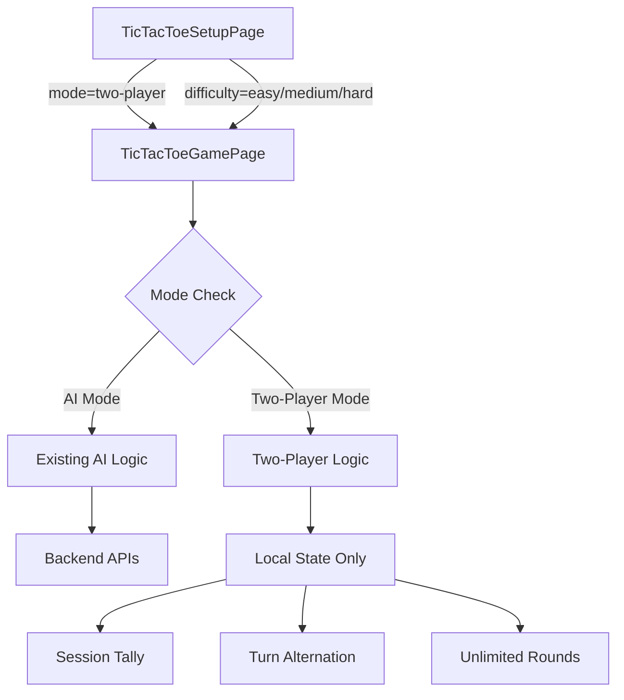

# Design Document: Tic Tac Toe Two-Player Mode

## Overview

This design adds a local Two-Player (hot-seat) mode to the existing Tic Tac Toe game. The mode allows two human players to alternate turns on the same device, playing as X and O. The feature integrates into the existing setup/game page architecture without requiring backend changes.

Key design decisions:
- **Reuse existing game infrastructure**: The board rendering, win detection, and cell interaction logic from the current `TicTacToeGamePage` are reused. The AI move logic is simply bypassed.
- **Mode parameter via URL**: The setup page navigates to the game page with a `mode=two-player` search parameter (similar to how `difficulty` is currently passed).
- **No fixed rounds**: Unlike AI mode (which uses `ROUNDS_PER_GAME = 5`), two-player mode allows unlimited rounds with a "Play Again" flow.
- **Session-only state**: All tally data lives in React component state (`useState`), automatically discarded on unmount.
- **No backend integration**: No `startGame` or `completeGame` API calls, no score submission, no `ScoreBreakdownModal`.

## Architecture

The feature modifies two existing components and requires no new services or pages:



The game page detects the mode from URL search params and conditionally:
- Skips API calls (`startGame`, `completeGame`)
- Disables AI move logic
- Uses a two-player turn indicator
- Replaces the fixed-round scoreboard with a session tally
- Replaces "See Results" with "Play Again"

## Components and Interfaces

### Modified: TicTacToeSetupPage

**Changes:**
- Add a "Two Player" option card visually separated from AI difficulty cards (e.g., in a distinct section or with a divider)
- The option uses a different visual style (e.g., a 👥 emoji, distinct color) to indicate it's not an AI difficulty
- On selection, navigate to `${ROUTES.TIC_TAC_TOE_GAME}?mode=two-player`

**Interface:**
```typescript
// New type for mode selection
type GameMode = 'ai' | 'two-player'

// Setup state extends to track mode
const [mode, setMode] = useState<GameMode>('ai')
const [difficulty, setDifficulty] = useState<Difficulty | ''>('')
```

### Modified: TicTacToeGamePage

**Changes:**
- Read `mode` from search params: `const mode = searchParams.get('mode')`
- Determine if two-player: `const isTwoPlayer = mode === 'two-player'`
- Conditional logic branches based on `isTwoPlayer`

**New State (Two-Player only):**
```typescript
// Turn tracking
const [activePlayer, setActivePlayer] = useState<'X' | 'O'>('X')

// Session tally (replaces wins/draws/losses/score for AI mode)
const [tally, setTally] = useState({ player1Wins: 0, player2Wins: 0, ties: 0 })
```

**Key Behavioral Differences:**

| Aspect | AI Mode | Two-Player Mode |
|--------|---------|-----------------|
| Turn management | `isPlayerTurn` boolean + AI timeout | `activePlayer` state alternation |
| Round count | Fixed (ROUNDS_PER_GAME = 5) | Unlimited |
| Score display | Wins/Draws/Losses/Score | P1 Wins / P2 Wins / Ties |
| Round end action | "Next Round" or "See Results" | "Play Again" |
| Backend calls | startGame + completeGame | None |
| End-of-game modal | ScoreBreakdownModal | None |
| Timer | Yes (for scoring) | Optional/decorative |

### Game Logic (shared)

The following utilities from `ticTacToeAI.ts` are reused without modification:
- `checkWinner(board)` — returns 'X', 'O', or null
- `getWinningLine(board)` — returns winning cell indices
- `isBoardFull(board)` — checks for draw
- `Board` and `Cell` types
- `WINNING_LINES` constant

### Turn Alternation Logic

```typescript
function handleCellClick(index: number) {
  if (board[index] || gamePhase !== 'playing') return

  const newBoard = [...board]
  newBoard[index] = activePlayer // 'X' or 'O'
  setBoard(newBoard)

  const winner = checkWinner(newBoard)
  if (winner || isBoardFull(newBoard)) {
    handleRoundEnd(newBoard, winner)
  } else {
    setActivePlayer(activePlayer === 'X' ? 'O' : 'X')
  }
}
```

### Tally Update Logic

```typescript
function handleRoundEnd(board: Board, winner: Cell) {
  setWinLine(getWinningLine(board))
  if (winner === 'X') {
    setTally(t => ({ ...t, player1Wins: t.player1Wins + 1 }))
  } else if (winner === 'O') {
    setTally(t => ({ ...t, player2Wins: t.player2Wins + 1 }))
  } else {
    setTally(t => ({ ...t, ties: t.ties + 1 }))
  }
  setGamePhase('round-end')
}
```

### Play Again Logic

```typescript
function playAgain() {
  setBoard([...EMPTY_BOARD])
  setActivePlayer('X')
  setWinLine(null)
  setGamePhase('playing')
}
```

## Data Models

### Session Tally (in-memory only)

```typescript
interface SessionTally {
  player1Wins: number  // Count of rounds won by X
  player2Wins: number  // Count of rounds won by O
  ties: number         // Count of drawn rounds
}
```

Initial state: `{ player1Wins: 0, player2Wins: 0, ties: 0 }`

No persistence layer. State lives in React component state and is discarded on unmount (navigation away).

### URL Parameters

| Parameter | Values | Purpose |
|-----------|--------|---------|
| `mode` | `'two-player'` | Indicates two-player mode |
| `difficulty` | `'easy' \| 'medium' \| 'hard'` | AI difficulty (mutually exclusive with mode) |

When `mode=two-player` is present, the `difficulty` param is ignored.

## Correctness Properties

*A property is a characteristic or behavior that should hold true across all valid executions of a system — essentially, a formal statement about what the system should do. Properties serve as the bridge between human-readable specifications and machine-verifiable correctness guarantees.*

### Property 1: Turn Alternation

*For any* valid board state in two-player mode where the game is still in progress, after the active player places their marker on an empty cell, the active player shall switch to the other player.

**Validates: Requirements 2.2, 2.3**

### Property 2: Active Player Enforcement

*For any* board state in two-player mode, the marker placed on a cell shall always match the current active player (X when it's Player 1's turn, O when it's Player 2's turn), and the turn indicator shall display the correct active player.

**Validates: Requirements 2.4, 2.5**

### Property 3: No Backend Calls in Two-Player Mode

*For any* sequence of moves and round completions in two-player mode, no calls to startGame or completeGame APIs shall be made.

**Validates: Requirements 3.1, 3.2, 3.3**

### Property 4: Tally Correctly Tracks Outcomes

*For any* round outcome (Player 1 win, Player 2 win, or tie), the corresponding tally counter shall increment by exactly 1 while all other counters remain unchanged.

**Validates: Requirements 4.4, 4.5, 4.6**

### Property 5: Board Reset Produces Initial State

*For any* completed round in two-player mode, triggering "Play Again" shall produce a board where all 9 cells are null and the active player is Player 1 (X).

**Validates: Requirements 2.1, 6.3**

### Property 6: No Round Limit

*For any* number of completed rounds N (where N > 0) in two-player mode, the game shall allow starting round N+1.

**Validates: Requirements 6.4**

### Property 7: Correct Result Display

*For any* completed board in two-player mode, if X occupies a winning line the result shall display "Player 1 wins", if O occupies a winning line the result shall display "Player 2 wins", and if the board is full with no winning line the result shall display "Tie".

**Validates: Requirements 6.1**

## Error Handling

This feature has minimal error surface since it's entirely client-side with no network calls:

| Scenario | Handling |
|----------|----------|
| Invalid mode parameter in URL | Fall back to AI mode (treat as `difficulty=easy`) |
| Direct navigation to game page without params | Fall back to AI mode |
| Rapid double-clicks on cells | Ignored — state guard (`board[index]` check) prevents double-placement |
| Browser back/forward navigation | React component unmounts/remounts — tally resets naturally |

No error modals or retry logic needed since there are no API calls in this mode.

## Testing Strategy

### Property-Based Tests (using fast-check)

Each correctness property above will be implemented as a property-based test with minimum 100 iterations. The property tests validate the core game logic functions:

- **Turn alternation**: Generate random valid board states, apply moves, verify turn switches
- **Active player enforcement**: Generate random game sequences, verify marker always matches active player
- **No backend calls**: Generate random game sessions, verify mock API functions are never called
- **Tally tracking**: Generate random sequences of round outcomes, verify tally state
- **Board reset**: Generate random completed boards, apply reset, verify initial state
- **No round limit**: Generate random N, simulate N rounds, verify N+1 can start
- **Result display**: Generate random terminal boards, verify correct result classification

**Configuration:**
- Library: `fast-check` (already available in the project ecosystem)
- Minimum iterations: 100 per property
- Tag format: `Feature: tic-tac-toe-two-player, Property {N}: {description}`

### Unit Tests (example-based)

- Setup page renders Two Player option
- Setup page navigates with `mode=two-player` on selection
- Game page does not call `startGame` in two-player mode
- Game page does not render `ScoreBreakdownModal` in two-player mode
- Back button navigates to setup page without API calls
- "Play Again" button appears after round end
- Tally initializes to all zeros on mount
- Invalid/missing mode parameter defaults to AI mode

### Integration Tests

- Full flow: select Two Player → play a round → see result → play again → verify tally
- Full flow: select Two Player → play multiple rounds → exit → return → verify tally reset
- Verify AI mode still works correctly with difficulty parameter (regression)
