# Execution Plan

## Detailed Analysis Summary

### Project Type
**Greenfield Project** - Building new memory game application from scratch

**MVP Scope**: Web application only (React responsive web app)
**Future Release**: iOS and Android mobile applications (Flutter)

### Change Impact Assessment
- **User-facing changes**: Yes - New user experience for web platform (responsive for desktop, tablet, mobile browsers)
- **Structural changes**: Yes - New system architecture with serverless AWS backend, React web frontend
- **Data model changes**: Yes - New data models for users, games, leaderboards, achievements, subscriptions, themes
- **API changes**: Yes - New REST API with authentication, game management, leaderboard, payment integration (designed to support future mobile apps)
- **NFR impact**: Yes - Security (SECURITY baseline rules), accessibility (WCAG 2.1 AA), performance, GDPR compliance

### Risk Assessment
- **Risk Level**: Medium (reduced from High due to single-platform MVP)
- **Complexity**: Moderate - Single-platform web application with payment processing, subscription management, and compliance requirements
- **Rollback Complexity**: Moderate - Serverless architecture allows for easy rollbacks
- **Testing Complexity**: Moderate (reduced from Complex) - Web-only testing, multiple subscription tiers, and user scenarios

---

## Workflow Visualization

```mermaid
flowchart TD
    Start(["User Request"])
    
    subgraph INCEPTION["🔵 INCEPTION PHASE"]
        WD["Workspace Detection<br/><b>COMPLETED</b>"]
        RA["Requirements Analysis<br/><b>COMPLETED</b>"]
        US["User Stories<br/><b>COMPLETED</b>"]
        WP["Workflow Planning<br/><b>IN PROGRESS</b>"]
        AD["Application Design<br/><b>EXECUTE</b>"]
        UG["Units Generation<br/><b>EXECUTE</b>"]
    end
    
    subgraph CONSTRUCTION["🟢 CONSTRUCTION PHASE"]
        FD["Functional Design<br/><b>EXECUTE</b>"]
        NFRA["NFR Requirements<br/><b>EXECUTE</b>"]
        NFRD["NFR Design<br/><b>EXECUTE</b>"]
        ID["Infrastructure Design<br/><b>EXECUTE</b>"]
        CP["Code Planning<br/><b>EXECUTE</b>"]
        CG["Code Generation<br/><b>EXECUTE</b>"]
        BT["Build and Test<br/><b>EXECUTE</b>"]
    end
    
    subgraph OPERATIONS["🟡 OPERATIONS PHASE"]
        OPS["Operations<br/><b>PLACEHOLDER</b>"]
    end
    
    Start --> WD
    WD --> RA
    RA --> US
    US --> WP
    WP --> AD
    AD --> UG
    UG --> FD
    FD --> NFRA
    NFRA --> NFRD
    NFRD --> ID
    ID --> CP
    CP --> CG
    CG --> BT
    BT --> End(["Complete"])
    
    style WD fill:#4CAF50,stroke:#1B5E20,stroke-width:3px,color:#fff
    style RA fill:#4CAF50,stroke:#1B5E20,stroke-width:3px,color:#fff
    style US fill:#4CAF50,stroke:#1B5E20,stroke-width:3px,color:#fff
    style WP fill:#FFA726,stroke:#E65100,stroke-width:3px,color:#000
    style AD fill:#FFA726,stroke:#E65100,stroke-width:3px,stroke-dasharray: 5 5,color:#000
    style UG fill:#FFA726,stroke:#E65100,stroke-width:3px,stroke-dasharray: 5 5,color:#000
    style FD fill:#FFA726,stroke:#E65100,stroke-width:3px,stroke-dasharray: 5 5,color:#000
    style NFRA fill:#FFA726,stroke:#E65100,stroke-width:3px,stroke-dasharray: 5 5,color:#000
    style NFRD fill:#FFA726,stroke:#E65100,stroke-width:3px,stroke-dasharray: 5 5,color:#000
    style ID fill:#FFA726,stroke:#E65100,stroke-width:3px,stroke-dasharray: 5 5,color:#000
    style CP fill:#FFA726,stroke:#E65100,stroke-width:3px,stroke-dasharray: 5 5,color:#000
    style CG fill:#FFA726,stroke:#E65100,stroke-width:3px,stroke-dasharray: 5 5,color:#000
    style BT fill:#FFA726,stroke:#E65100,stroke-width:3px,stroke-dasharray: 5 5,color:#000
    style OPS fill:#BDBDBD,stroke:#424242,stroke-width:2px,stroke-dasharray: 5 5,color:#000
    style Start fill:#CE93D8,stroke:#6A1B9A,stroke-width:3px,color:#000
    style End fill:#CE93D8,stroke:#6A1B9A,stroke-width:3px,color:#000
    style INCEPTION fill:#BBDEFB,stroke:#1976D2,stroke-width:2px
    style CONSTRUCTION fill:#C8E6C9,stroke:#388E3C,stroke-width:2px
    style OPERATIONS fill:#FFF59D,stroke:#F57F17,stroke-width:2px
    
    linkStyle default stroke:#333,stroke-width:2px
```

---

## Phases to Execute

### 🔵 INCEPTION PHASE
- [x] Workspace Detection (COMPLETED)
- [x] Requirements Analysis (COMPLETED)
- [x] User Stories (COMPLETED)
- [x] Workflow Planning (IN PROGRESS)
- [ ] Application Design - **EXECUTE**
  - **Rationale**: New system requires comprehensive component design, service layer architecture, and API specifications. Need to define components for authentication, game engine, leaderboard, payment integration, CMS, and admin dashboard.
- [ ] Units Generation - **EXECUTE**
  - **Rationale**: Complex system requires decomposition into manageable units. Will break down into: Frontend (Web + Mobile), Backend Services (Auth, Game, Leaderboard, Payment, Admin), Infrastructure, and Shared Components.

### 🟢 CONSTRUCTION PHASE

**Per-Unit Loop** (executes for each unit generated in Units Generation):

- [ ] Functional Design - **EXECUTE**
  - **Rationale**: Each unit requires detailed data models, business logic, and API specifications. Need to design database schemas, game algorithms, scoring logic, subscription workflows, and CMS data structures.
  
- [ ] NFR Requirements - **EXECUTE**
  - **Rationale**: Significant NFR requirements including SECURITY baseline rules (15 rules), WCAG 2.1 AA accessibility, performance targets, GDPR compliance, and scalability for 10,000+ concurrent users.
  
- [ ] NFR Design - **EXECUTE**
  - **Rationale**: NFR requirements need specific design patterns: security controls (encryption, IAM policies, input validation), accessibility patterns (ARIA, keyboard navigation), performance optimizations (caching, CDN), and GDPR mechanisms (data export, deletion).
  
- [ ] Infrastructure Design - **EXECUTE**
  - **Rationale**: Serverless AWS architecture requires detailed infrastructure design: Lambda functions, API Gateway, DynamoDB tables, S3 buckets, CloudFront CDN, Cognito/auth service, VPC configuration, and monitoring setup.
  
- [ ] Code Planning - **EXECUTE** (ALWAYS)
  - **Rationale**: Implementation approach needed for all units
  
- [ ] Code Generation - **EXECUTE** (ALWAYS)
  - **Rationale**: Code implementation needed for all units
  
- [ ] Build and Test - **EXECUTE** (ALWAYS)
  - **Rationale**: Build, test, and verification needed

### 🟡 OPERATIONS PHASE
- [ ] Operations - **PLACEHOLDER**
  - **Rationale**: Future deployment and monitoring workflows (not in current scope)

---

## Execution Sequence

### Phase 1: INCEPTION - Application Design
**Purpose**: Define system architecture, components, and service boundaries

**Key Deliverables**:
- System architecture diagram
- Component specifications (authentication, game engine, leaderboard, payment, CMS, admin)
- API specifications and contracts
- Data flow diagrams
- Integration points (Stripe, AWS services)

### Phase 2: INCEPTION - Units Generation
**Purpose**: Decompose system into manageable implementation units

**Expected Units (MVP - Web Only)**:
1. **Web Frontend** - React application with responsive design (desktop, tablet, mobile browsers)
2. **Authentication Service** - User registration, login, session management
3. **Game Service** - Game engine, gameplay logic, rate limiting
4. **Leaderboard Service** - Score calculation, rankings, time periods
5. **Payment Service** - Stripe integration, subscription management
6. **Admin Service** - Dashboard, user management, analytics
7. **CMS Service** - Theme management, content publishing
8. **Infrastructure** - AWS resources, networking, monitoring
9. **Shared Components** - Common models, utilities, API clients

**Deferred to Future Release**:
- Mobile Frontend (Flutter for iOS and Android)

**Note**: Backend API will be designed to support future mobile apps, ensuring smooth integration when mobile development begins.

### Phase 3: CONSTRUCTION - Per-Unit Design and Implementation
**For each unit, execute**:
1. Functional Design - Data models, business logic, APIs
2. NFR Requirements - Security, performance, accessibility requirements
3. NFR Design - Security patterns, performance optimizations, accessibility implementation
4. Infrastructure Design - AWS resources, deployment configuration
5. Code Planning - Implementation approach and steps
6. Code Generation - Actual code implementation
7. Build and Test - Verification and testing

### Phase 4: CONSTRUCTION - Build and Test
**Purpose**: Integrate all units and verify system functionality

**Key Activities**:
- Build all components
- Unit testing per component
- Integration testing across services
- End-to-end testing across platforms
- Performance testing
- Security testing
- Accessibility testing
- GDPR compliance verification

---

## Estimated Timeline

**Total Stages to Execute**: 11 stages (6 INCEPTION + 5 CONSTRUCTION per unit × 9 units + 1 Build and Test)

**Estimated Duration**: 
- INCEPTION Phase: 3-4 weeks
  - Application Design: 1 week
  - Units Generation: 1 week
- CONSTRUCTION Phase: 9-12 weeks
  - Per-Unit Design: 1 week per unit
  - Per-Unit Implementation: 1 week per unit
  - Build and Test: 2 weeks

**Total Estimated Duration**: 12-16 weeks (reduced from 16-22 weeks)

**Future Mobile Release**: Additional 6-8 weeks for Flutter mobile apps

---

## Success Criteria

### Primary Goal
Build a fully functional web-based memory game application with free and paid subscription tiers, meeting all functional and non-functional requirements. Application must be responsive and work well on desktop, tablet, and mobile browsers.

### Key Deliverables (MVP - Web Only)
- Web application (React) deployed and accessible on all devices (responsive design)
- Backend services (AWS Lambda) deployed and operational
- Stripe payment integration functional
- Admin dashboard and CMS operational
- All SECURITY baseline rules verified
- WCAG 2.1 AA compliance verified
- GDPR compliance mechanisms implemented
- API designed to support future mobile apps

### Key Deliverables (Future Release)
- Mobile applications (Flutter) for iOS App Store and Google Play Store

### Quality Gates
- All web-focused user stories have acceptance criteria met
- All 15 SECURITY baseline rules compliant
- WCAG 2.1 AA accessibility verified for web
- Performance targets met (load time < 2s, API response < 500ms)
- Responsive design works on desktop, tablet, and mobile browsers
- 99.9% uptime achieved in production
- All unit tests passing
- Integration tests passing
- End-to-end tests passing for web platform

---

## Risk Mitigation

### High-Risk Areas
1. **Payment Integration**: Stripe integration complexity, subscription state management
2. **Responsive Design**: Ensuring excellent experience across desktop, tablet, and mobile browsers
3. **Security Compliance**: Meeting all 15 SECURITY baseline rules
4. **Accessibility**: Achieving WCAG 2.1 AA compliance
5. **Performance**: Meeting performance targets with serverless architecture
6. **GDPR Compliance**: Implementing all data subject rights

### Mitigation Strategies
- Early Stripe integration testing and sandbox environment usage
- Mobile-first responsive design approach with thorough device testing
- Security review at each stage with automated scanning
- Accessibility testing with screen readers and automated tools
- Performance testing and optimization throughout development
- GDPR compliance checklist and legal review

### Future Mobile App Considerations
- Backend API designed with mobile apps in mind (RESTful, versioned)
- Authentication system supports mobile token management
- Responsive web design validates UI/UX patterns for mobile
- Game mechanics tested on mobile browsers inform native app design

---

## Notes

- This is a greenfield project, so no reverse engineering or brownfield-specific steps are needed
- User Stories stage was executed and provided comprehensive coverage (47 stories)
- **MVP Scope**: Web application only with responsive design for desktop, tablet, and mobile browsers
- **Future Release**: iOS and Android native apps using Flutter (deferred from MVP)
- Backend API will be designed to support future mobile apps from the start
- All CONSTRUCTION stages will execute for each unit due to complexity and NFR requirements
- Operations phase is placeholder for future deployment automation
- Adaptive depth will be applied within each stage based on unit complexity
- Estimated timeline reduced from 16-22 weeks to 12-16 weeks due to single-platform MVP
- Mobile app development estimated at additional 6-8 weeks when prioritized
